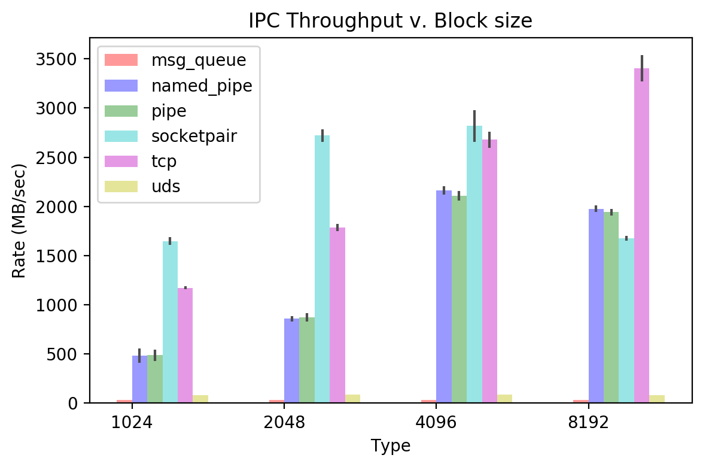

# IPC Report

FreeBSD 11.1 release

Intel Core i7-4930K
16GB DDR3

## Requirements

python 3.6.x

pweave

## Usage

```console
shraken@mint-vbox ~/shraken_code/ipc_benchmark $ python benchmark.py 
usage: benchmark.py [-h] [-t,--trials [TRIAL_RUNS]] [-v,--verbose]
                    [-f,--file SAVE_FILE]

Test the DAC, ADC, and PWM function of the Buddy DAQ device

optional arguments:
  -h, --help            show this help message and exit
  -t,--trials [TRIAL_RUNS]
                        number of trials to be run for each IPC test
  -v,--verbose          enable verbose printing
  -f,--file SAVE_FILE   filename to save pickle results to
```

## Running It

```console
shraken@mint-vbox ~/shraken_code/ipc_benchmark $ python benchmark.py -v -t 100 -f result.dat
```

## Benchmark Result

The figure below compares the throughput (MB/sec) for the different IPC methods when varying the block
size of transmission.  The transfer size for each test is fixed at 100 Megabytes.  


```python
import numpy as np
import matplotlib.pyplot as plt
import pickle
from pprint import pprint
from prettytable import PrettyTable

IPC_BLOCK_SIZE_1024 = 1024
IPC_BLOCK_SIZE_2048 = 2048
IPC_BLOCK_SIZE_4096 = 4096
IPC_BLOCK_SIZE_8192 = 8192

typesToParse = [ 'msg_queue', 'named_pipe', 'pipe', 'socketpair', 'tcp', 'uds' ]
blockSizeList = [ IPC_BLOCK_SIZE_1024, IPC_BLOCK_SIZE_2048, 
                  IPC_BLOCK_SIZE_4096, IPC_BLOCK_SIZE_8192 ]

def getMaxMinValue(results, key):
    return (0, 0)
    #return [ max(results), min(results) ]

def plotResults(filename):
    with open(filename, "rb") as handle:
        result = pickle.load(handle)
    
    colorTypes = [ 'r', 'b', 'g', 'c', 'm', 'y' ]

    n_groups = 4
    fig, ax = plt.subplots()

    index = np.arange(n_groups)
    bar_width = 0.1

    opacity = 0.4
    error_config = {'ecolor': '0.3'}

    #resultMean = {key: None for key in typesToParse}
    #blankList = {int(key): [] for key in blockSizeList}
    #resultMean = {key: blankList for key in typesToParse}
    #resultStd = {key: blankList for key in typesToParse}

    resultMean = {
        'msg_queue' : {
            IPC_BLOCK_SIZE_1024: [],
            IPC_BLOCK_SIZE_2048: [],
            IPC_BLOCK_SIZE_4096: [],
            IPC_BLOCK_SIZE_8192: [],
        },
        'named_pipe': {
            IPC_BLOCK_SIZE_1024: [],
            IPC_BLOCK_SIZE_2048: [],
            IPC_BLOCK_SIZE_4096: [],
            IPC_BLOCK_SIZE_8192: [],
        },
        'pipe': {
            IPC_BLOCK_SIZE_1024: [],
            IPC_BLOCK_SIZE_2048: [],
            IPC_BLOCK_SIZE_4096: [],
            IPC_BLOCK_SIZE_8192: [],
        },
        'socketpair': {
            IPC_BLOCK_SIZE_1024: [],
            IPC_BLOCK_SIZE_2048: [],
            IPC_BLOCK_SIZE_4096: [],
            IPC_BLOCK_SIZE_8192: [],
        },
        'tcp': {
            IPC_BLOCK_SIZE_1024: [],
            IPC_BLOCK_SIZE_2048: [],
            IPC_BLOCK_SIZE_4096: [],
            IPC_BLOCK_SIZE_8192: [],
        },
        'uds': {
            IPC_BLOCK_SIZE_1024: [],
            IPC_BLOCK_SIZE_2048: [],
            IPC_BLOCK_SIZE_4096: [],
            IPC_BLOCK_SIZE_8192: [],
        }
    }

    resultStd = {
        'msg_queue' : {
            IPC_BLOCK_SIZE_1024: [],
            IPC_BLOCK_SIZE_2048: [],
            IPC_BLOCK_SIZE_4096: [],
            IPC_BLOCK_SIZE_8192: [],
        },
        'named_pipe': {
            IPC_BLOCK_SIZE_1024: [],
            IPC_BLOCK_SIZE_2048: [],
            IPC_BLOCK_SIZE_4096: [],
            IPC_BLOCK_SIZE_8192: [],
        },
        'pipe': {
            IPC_BLOCK_SIZE_1024: [],
            IPC_BLOCK_SIZE_2048: [],
            IPC_BLOCK_SIZE_4096: [],
            IPC_BLOCK_SIZE_8192: [],
        },
        'socketpair': {
            IPC_BLOCK_SIZE_1024: [],
            IPC_BLOCK_SIZE_2048: [],
            IPC_BLOCK_SIZE_4096: [],
            IPC_BLOCK_SIZE_8192: [],
        },
        'tcp': {
            IPC_BLOCK_SIZE_1024: [],
            IPC_BLOCK_SIZE_2048: [],
            IPC_BLOCK_SIZE_4096: [],
            IPC_BLOCK_SIZE_8192: [],
        },
        'uds': {
            IPC_BLOCK_SIZE_1024: [],
            IPC_BLOCK_SIZE_2048: [],
            IPC_BLOCK_SIZE_4096: [],
            IPC_BLOCK_SIZE_8192: [],
        }
    }

    for idx, typeParse in enumerate(typesToParse):
        means_temp = ( np.mean(result[typeParse][IPC_BLOCK_SIZE_1024]),
                       np.mean(result[typeParse][IPC_BLOCK_SIZE_2048]),
                       np.mean(result[typeParse][IPC_BLOCK_SIZE_4096]),
                       np.mean(result[typeParse][IPC_BLOCK_SIZE_8192]) )

        stds_temp = ( np.std(result[typeParse][IPC_BLOCK_SIZE_1024]),
                      np.std(result[typeParse][IPC_BLOCK_SIZE_2048]),
                      np.std(result[typeParse][IPC_BLOCK_SIZE_4096]),
                      np.std(result[typeParse][IPC_BLOCK_SIZE_8192]) )

        rects_temp = plt.bar(index + (idx * bar_width), means_temp, bar_width,
                             alpha=opacity,
                             color=colorTypes[idx],
                             yerr=stds_temp,
                             error_kw=error_config,
                             label=typeParse)

        for blockMean, blockStd, blockSize in zip(means_temp, stds_temp, blockSizeList):
            resultMean[typeParse][blockSize] = blockMean
            resultStd[typeParse][blockSize] = blockStd

    plt.xlabel('Type')
    plt.ylabel('Rate (MB/sec)')
    plt.title('IPC Throughput v. Block size')
    plt.xticks(index + bar_width / 2, ('1024', '2048', '4096', '8192'))
    plt.legend()

    plt.tight_layout()
    plt.show()

    return (resultMean, resultStd)

(resultMean, resultStd) = plotResults('results/dat/freebsd_result.dat')

headers = ['', 
           '{:^12}'.format(IPC_BLOCK_SIZE_1024), 
           '{:^12}'.format(IPC_BLOCK_SIZE_2048), 
           '{:^12}'.format(IPC_BLOCK_SIZE_4096), 
           '{:^12}'.format(IPC_BLOCK_SIZE_8192) ]
t = PrettyTable(headers)

for ipcType in typesToParse:
    data = [ '{}'.format(ipcType),
             '{0:.2f}'.format(resultMean[ipcType][IPC_BLOCK_SIZE_1024]),
             '{0:.2f}'.format(resultMean[ipcType][IPC_BLOCK_SIZE_2048]),
             '{0:.2f}'.format(resultMean[ipcType][IPC_BLOCK_SIZE_4096]),
             '{0:.2f}'.format(resultMean[ipcType][IPC_BLOCK_SIZE_8192]) ]

    t.add_row(data)

print(t)
```

```
+------------+--------------+--------------+--------------+--------------+
|            |     1024     |     2048     |     4096     |     8192
|
+------------+--------------+--------------+--------------+--------------+
| msg_queue  |    31.35     |    31.33     |    31.30     |    31.35
|
| named_pipe |    481.15    |    857.70    |   2164.04    |   1976.68
|
|    pipe    |    488.02    |    871.70    |   2107.21    |   1941.09
|
| socketpair |   1648.05    |   2720.23    |   2817.04    |   1676.99
|
|    tcp     |   1173.02    |   1784.93    |   2678.91    |   3404.71
|
|    uds     |    83.89     |    85.67     |    85.97     |    84.06
|
+------------+--------------+--------------+--------------+--------------+
```

\

