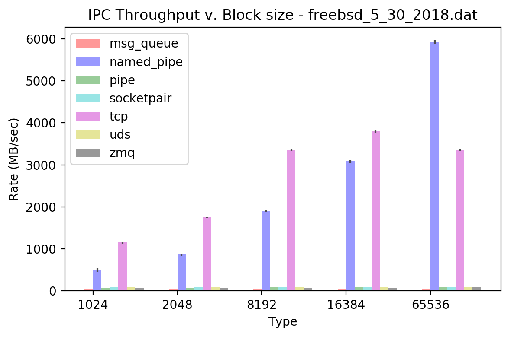

# IPC Report

## Requirements

python 3.6.x

pweave

## Usage

```console
shraken@mint-vbox ~/shraken_code/ipc_benchmark $ python benchmark.py 
usage: benchmark.py [-h] [-t,--trials [TRIAL_RUNS]] [-v,--verbose]
                    [-f,--file SAVE_FILE]

Test the DAC, ADC, and PWM function of the Buddy DAQ device

optional arguments:
  -h, --help            show this help message and exit
  -t,--trials [TRIAL_RUNS]
                        number of trials to be run for each IPC test
  -v,--verbose          enable verbose printing
  -f,--file SAVE_FILE   filename to save pickle results to
```

## Running It

```console
shraken@mint-vbox ~/shraken_code/ipc_benchmark $ python benchmark.py -v -t 100 -f result.dat
```

## Benchmark Result

The figure below compares the throughput (MB/sec) for the different IPC methods when varying the block
size of transmission.  The transfer size for each test is fixed at 100 Megabytes.  


```python
import numpy as np
import matplotlib.pyplot as plt
import pickle
from pprint import pprint
from prettytable import PrettyTable

IPC_BLOCK_SIZE_1024 = 1024
IPC_BLOCK_SIZE_2048 = 2048
IPC_BLOCK_SIZE_4096 = 4096
IPC_BLOCK_SIZE_8192 = 8192
IPC_BLOCK_SIZE_16384 = 16384
IPC_BLOCK_SIZE_32768 = 32768
IPC_BLOCK_SIZE_65536 = 65536

typesToParse = [ 'msg_queue', 'named_pipe', 'pipe', 'socketpair', 'tcp', 'uds', 'zmq' ]
blockSizeList = [ IPC_BLOCK_SIZE_1024, IPC_BLOCK_SIZE_2048, 
                  IPC_BLOCK_SIZE_4096, IPC_BLOCK_SIZE_8192 ]

def getMaxMinValue(results, key):
    return (0, 0)
    #return [ max(results), min(results) ]

def plotResults(filename):
    with open(filename, "rb") as handle:
        result = pickle.load(handle)
    
    print('recorded results')
    print(result)

    colorTypes = [ 'r', 'b', 'g', 'c', 'm', 'y', 'k' ]

    n_groups = 5
    fig, ax = plt.subplots()

    index = np.arange(n_groups)
    bar_width = 0.1

    opacity = 0.4
    error_config = {'ecolor': '0.3'}

    #resultMean = {key: None for key in typesToParse}
    #blankList = {int(key): [] for key in blockSizeList}
    #resultMean = {key: blankList for key in typesToParse}
    #resultStd = {key: blankList for key in typesToParse}

    resultMean = {
        'msg_queue' : {
            IPC_BLOCK_SIZE_1024: [],
            IPC_BLOCK_SIZE_2048: [],
            IPC_BLOCK_SIZE_4096: [],
            IPC_BLOCK_SIZE_8192: [],
            IPC_BLOCK_SIZE_16384: [],
            IPC_BLOCK_SIZE_32768: [],
            IPC_BLOCK_SIZE_65536: [],
        },
        'named_pipe': {
            IPC_BLOCK_SIZE_1024: [],
            IPC_BLOCK_SIZE_2048: [],
            IPC_BLOCK_SIZE_4096: [],
            IPC_BLOCK_SIZE_8192: [],
            IPC_BLOCK_SIZE_16384: [],
            IPC_BLOCK_SIZE_32768: [],
            IPC_BLOCK_SIZE_65536: [],
        },
        'pipe': {
            IPC_BLOCK_SIZE_1024: [],
            IPC_BLOCK_SIZE_2048: [],
            IPC_BLOCK_SIZE_4096: [],
            IPC_BLOCK_SIZE_8192: [],
            IPC_BLOCK_SIZE_16384: [],
            IPC_BLOCK_SIZE_32768: [],
            IPC_BLOCK_SIZE_65536: [],
        },
        'socketpair': {
            IPC_BLOCK_SIZE_1024: [],
            IPC_BLOCK_SIZE_2048: [],
            IPC_BLOCK_SIZE_4096: [],
            IPC_BLOCK_SIZE_8192: [],
            IPC_BLOCK_SIZE_16384: [],
            IPC_BLOCK_SIZE_32768: [],
            IPC_BLOCK_SIZE_65536: [],
        },
        'tcp': {
            IPC_BLOCK_SIZE_1024: [],
            IPC_BLOCK_SIZE_2048: [],
            IPC_BLOCK_SIZE_4096: [],
            IPC_BLOCK_SIZE_8192: [],
            IPC_BLOCK_SIZE_16384: [],
            IPC_BLOCK_SIZE_32768: [],
            IPC_BLOCK_SIZE_65536: [],
        },
        'uds': {
            IPC_BLOCK_SIZE_1024: [],
            IPC_BLOCK_SIZE_2048: [],
            IPC_BLOCK_SIZE_4096: [],
            IPC_BLOCK_SIZE_8192: [],
            IPC_BLOCK_SIZE_16384: [],
            IPC_BLOCK_SIZE_32768: [],
            IPC_BLOCK_SIZE_65536: [],
        },
        'zmq': {
            IPC_BLOCK_SIZE_1024: [],
            IPC_BLOCK_SIZE_2048: [],
            IPC_BLOCK_SIZE_4096: [],
            IPC_BLOCK_SIZE_8192: [],
            IPC_BLOCK_SIZE_16384: [],
            IPC_BLOCK_SIZE_32768: [],
            IPC_BLOCK_SIZE_65536: [],
        }
    }

    resultStd = {
        'msg_queue' : {
            IPC_BLOCK_SIZE_1024: [],
            IPC_BLOCK_SIZE_2048: [],
            IPC_BLOCK_SIZE_4096: [],
            IPC_BLOCK_SIZE_8192: [],
            IPC_BLOCK_SIZE_16384: [],
            IPC_BLOCK_SIZE_32768: [],
            IPC_BLOCK_SIZE_65536: [],
        },
        'named_pipe': {
            IPC_BLOCK_SIZE_1024: [],
            IPC_BLOCK_SIZE_2048: [],
            IPC_BLOCK_SIZE_4096: [],
            IPC_BLOCK_SIZE_8192: [],
            IPC_BLOCK_SIZE_16384: [],
            IPC_BLOCK_SIZE_32768: [],
            IPC_BLOCK_SIZE_65536: [],
        },
        'pipe': {
            IPC_BLOCK_SIZE_1024: [],
            IPC_BLOCK_SIZE_2048: [],
            IPC_BLOCK_SIZE_4096: [],
            IPC_BLOCK_SIZE_8192: [],
            IPC_BLOCK_SIZE_16384: [],
            IPC_BLOCK_SIZE_32768: [],
            IPC_BLOCK_SIZE_65536: [],
        },
        'socketpair': {
            IPC_BLOCK_SIZE_1024: [],
            IPC_BLOCK_SIZE_2048: [],
            IPC_BLOCK_SIZE_4096: [],
            IPC_BLOCK_SIZE_8192: [],
            IPC_BLOCK_SIZE_16384: [],
            IPC_BLOCK_SIZE_32768: [],
            IPC_BLOCK_SIZE_65536: [],
        },
        'tcp': {
            IPC_BLOCK_SIZE_1024: [],
            IPC_BLOCK_SIZE_2048: [],
            IPC_BLOCK_SIZE_4096: [],
            IPC_BLOCK_SIZE_8192: [],
            IPC_BLOCK_SIZE_16384: [],
            IPC_BLOCK_SIZE_32768: [],
            IPC_BLOCK_SIZE_65536: [],
        },
        'uds': {
            IPC_BLOCK_SIZE_1024: [],
            IPC_BLOCK_SIZE_2048: [],
            IPC_BLOCK_SIZE_4096: [],
            IPC_BLOCK_SIZE_8192: [],
            IPC_BLOCK_SIZE_16384: [],
            IPC_BLOCK_SIZE_32768: [],
            IPC_BLOCK_SIZE_65536: [],
        },
        'zmq': {
            IPC_BLOCK_SIZE_1024: [],
            IPC_BLOCK_SIZE_2048: [],
            IPC_BLOCK_SIZE_4096: [],
            IPC_BLOCK_SIZE_8192: [],
            IPC_BLOCK_SIZE_16384: [],
            IPC_BLOCK_SIZE_32768: [],
            IPC_BLOCK_SIZE_65536: [],
        }
    }

    for idx, typeParse in enumerate(typesToParse):
        means_temp = ( np.mean(result[typeParse][IPC_BLOCK_SIZE_1024]),
                       np.mean(result[typeParse][IPC_BLOCK_SIZE_2048]),
                       np.mean(result[typeParse][IPC_BLOCK_SIZE_8192]),
                       np.mean(result[typeParse][IPC_BLOCK_SIZE_16384]),
                       np.mean(result[typeParse][IPC_BLOCK_SIZE_65536]) )

        stds_temp = ( np.std(result[typeParse][IPC_BLOCK_SIZE_1024]),
                      np.std(result[typeParse][IPC_BLOCK_SIZE_2048]),
                      np.std(result[typeParse][IPC_BLOCK_SIZE_8192]),
                      np.std(result[typeParse][IPC_BLOCK_SIZE_16384]),
                      np.std(result[typeParse][IPC_BLOCK_SIZE_65536]) )

        #print('typeParse')
        #print(typeParse)
        #print('means_temp')
        #print(means_temp)

        #print('means_temp')
        #print(means_temp)
        #print('stds_temp')
        #print(stds_temp)

        rects_temp = plt.bar(index + (idx * bar_width), means_temp, bar_width,
                             alpha=opacity,
                             color=colorTypes[idx],
                             yerr=stds_temp,
                             error_kw=error_config,
                             label=typeParse)

        for blockMean, blockStd, blockSize in zip(means_temp, stds_temp, blockSizeList):
            resultMean[typeParse][blockSize] = blockMean
            resultStd[typeParse][blockSize] = blockStd

    plt.xlabel('Type')
    plt.ylabel('Rate (MB/sec)')
    plt.title('IPC Throughput v. Block size - {}'.format(filename))
    plt.xticks(index + bar_width / 2, ('1024', '2048', '8192', '16384',  '65536'))
    plt.legend()

    plt.tight_layout()
    plt.show()

    return (resultMean, resultStd)

(resultMean, resultStd) = plotResults('freebsd_5_30_2018.dat')

headers = ['', 
           '{:^12}'.format(IPC_BLOCK_SIZE_1024), 
           '{:^12}'.format(IPC_BLOCK_SIZE_2048), 
           '{:^12}'.format(IPC_BLOCK_SIZE_4096), 
           '{:^12}'.format(IPC_BLOCK_SIZE_8192) ]
t = PrettyTable(headers)

for ipcType in typesToParse:
    data = [ '{}'.format(ipcType),
             '{0:.2f}'.format(resultMean[ipcType][IPC_BLOCK_SIZE_1024]),
             '{0:.2f}'.format(resultMean[ipcType][IPC_BLOCK_SIZE_2048]),
             '{0:.2f}'.format(resultMean[ipcType][IPC_BLOCK_SIZE_4096]),
             '{0:.2f}'.format(resultMean[ipcType][IPC_BLOCK_SIZE_8192]) ]

    t.add_row(data)

print(t)
```

```
recorded results
{'uds': {1024: [84.782877, 84.680197, 84.613222, 84.616866, 84.708169,
84.670572, 83.032088, 84.605379, 84.720581, 84.658854, 84.596458,
84.663898, 85.029394, 84.611251, 84.734569, 84.712193, 84.690887,
84.677489, 84.789296, 84.583708, 84.828662, 84.696596, 84.693626,
84.583629, 84.68264], 2048: [86.509002, 86.501893, 84.79869,
86.424793, 86.59196, 86.588064, 86.520116, 86.521316, 85.079512,
87.029681, 86.593479, 86.513305, 86.728733, 86.521206, 86.649901,
86.622065, 86.507727, 86.533658, 86.546449, 86.480337, 86.568683,
86.584612, 86.472523, 86.548085, 86.534519], 4096: [86.766192,
86.75062, 86.833469, 87.109946, 87.041324, 86.783938, 87.004538,
86.829031, 86.846377, 86.883272, 87.01695, 86.823098, 87.088045,
86.756237, 86.911488, 80.782382, 86.701667, 83.782431, 86.894327,
87.072382, 86.402342, 87.052287, 86.953978, 86.950329, 87.052207],
16384: [84.853827, 84.752725, 84.808553, 84.813778, 84.99757,
84.780723, 84.831804, 84.817936, 84.781599, 84.793297, 84.683688,
84.775681, 84.811281, 84.846387, 84.820449, 84.967982, 84.795322,
79.853802, 84.815997, 84.799794, 84.757644, 84.754059, 84.800113,
84.81547, 84.790915], 8192: [84.795114, 84.935062, 84.831702,
84.796141, 84.718772, 84.781815, 84.853827, 84.674565, 84.791985,
84.78064, 85.382695, 80.093886, 84.827029, 84.778452, 84.786046,
84.910746, 84.801213, 84.770252, 84.828157, 84.841402, 84.803318,
84.82027, 84.837043, 84.840992, 84.882514], 65536: [84.714131,
84.819333, 84.757037, 84.751558, 84.819044, 84.780935, 84.802024,
84.79635, 84.846881, 84.755639, 84.841147, 84.849296, 84.786846,
84.792982, 84.919258, 84.802832, 84.762945, 84.834549, 84.781913,
84.809809, 84.696381, 84.79115, 81.414194, 84.746633, 84.743266],
32768: [84.824153, 84.782748, 84.733335, 84.805245, 84.788242,
84.767114, 84.779385, 84.462751, 84.769445, 84.699794, 84.98825,
84.844109, 84.716311, 84.736762, 84.711757, 84.803155, 84.733619,
84.833585, 84.795265, 84.869431, 84.8608, 80.589752, 84.849623,
84.736164, 84.815261]}, 'named_pipe': {1024: [484.600604, 470.079489,
493.78696, 568.21072, 454.814571, 505.06454, 466.308313, 512.053518,
456.233725, 450.342422, 448.707364, 590.660538, 462.829243,
532.898226, 457.928179, 470.375034, 475.721159, 511.73838, 611.331574,
451.083809, 504.99512, 549.209123, 501.074769, 595.24682, 503.496892],
2048: [850.372053, 849.775527, 914.555658, 870.766293, 838.866368,
834.179796, 893.318862, 839.500083, 856.834612, 899.377782,
854.371037, 848.987417, 919.160892, 879.216854, 849.275701,
898.016654, 837.003837, 840.256146, 877.759123, 846.105862,
865.577659, 857.783271, 886.552624, 831.864671, 872.982037], 4096:
[2152.500307, 2130.310854, 2104.417361, 2140.700091, 2157.222534,
2145.535729, 2156.734167, 2101.948815, 2157.831462, 2120.031455,
2148.412066, 2152.803397, 2114.467713, 2143.934355, 2100.861042,
2164.465933, 2162.621539, 2121.208, 2103.700466, 2130.114581,
2101.811325, 2129.021378, 2074.611257, 2080.505653, 2096.537418],
16384: [3074.623921, 3096.301911, 3040.715673, 3099.43026,
3079.538365, 3073.133715, 3068.666784, 3094.447123, 3072.560943,
3065.694386, 3181.77996, 3065.258191, 3140.156307, 3065.124383,
3097.693196, 3151.604138, 2997.053903, 3121.589206, 3092.917461,
3062.322068, 3110.643792, 3072.112836, 3104.114326, 3029.244501,
3062.762375], 8192: [1884.462102, 1874.035992, 1932.535859,
1923.420725, 1901.306876, 1940.867111, 1927.970459, 1886.611199,
1910.559644, 1882.721665, 1906.239193, 1924.660674, 1929.302668,
1904.135053, 1916.103532, 1921.644625, 1880.286719, 1907.581835,
1936.709342, 1886.093167, 1900.161577, 1915.80147, 1929.825066,
1912.432976, 1889.921294], 65536: [5989.231684, 5908.390962,
5927.325448, 5950.80531, 5815.861364, 5852.830388, 6033.279682,
5877.526028, 5942.467505, 5828.825236, 5880.297044, 5952.972861,
5943.380352, 5956.376857, 5910.343455, 5922.899639, 5867.539269,
5925.343201, 5906.071752, 6007.603386, 5894.942842, 6025.800838,
5935.342043, 5896.317908, 5937.554129], 32768: [4544.077314,
4537.660324, 4609.965855, 4572.087939, 4617.76984, 4576.823132,
4553.047912, 4490.657596, 4521.060658, 4546.22398, 4600.99311,
4565.492697, 4567.571611, 4590.58748, 4585.014155, 4648.761584,
4555.159284, 4531.651356, 4510.476423, 4540.061852, 4640.761703,
4539.07268, 4628.751216, 4500.016397, 4542.792464]}, 'msg_queue':
{1024: [33.26817, 33.69696, 33.61858, 33.647524, 33.382935, 33.556228,
33.394114, 33.950117, 33.474565, 33.552765, 33.344225, 33.534836,
33.676815, 33.809999, 33.282936, 34.236469, 33.59688, 33.478958,
33.41595, 33.338583, 33.605164, 34.13041, 33.143787, 33.320602,
33.265535], 2048: [33.395318, 33.560666, 33.470286, 33.172231,
33.598472, 33.532777, 33.454687, 34.155294, 33.444222, 33.487212,
33.47955, 33.484853, 33.549383, 33.456298, 33.564712, 33.937655,
33.553233, 33.366357, 33.624264, 33.610401, 33.392087, 33.493932,
33.432855, 33.534629, 33.441415], 4096: [33.771467, 33.386941,
33.454532, 33.310761, 33.348624, 33.506175, 33.444878, 33.689133,
33.504454, 33.544223, 33.422883, 33.717732, 33.506681, 33.476203,
33.551597, 33.423076, 33.759106, 33.525825, 33.597546, 33.790213,
33.377926, 33.339692, 33.559507, 33.562516, 33.537302], 16384:
[33.259114, 33.449647, 33.390027, 33.650333, 33.499087, 33.692247,
33.464347, 33.712697, 33.426834, 33.694003, 33.768072, 33.570235,
33.59301, 33.519065, 33.322156, 33.577103, 33.534686, 33.487952,
33.631378, 33.555025, 33.521037, 33.435989, 33.504725, 33.472921,
33.473408], 8192: [33.543611, 33.604099, 33.300605, 33.287608,
33.381343, 33.552993, 33.517019, 33.384924, 33.207218, 33.854078,
33.548756, 34.021501, 33.25999, 33.521084, 33.508464, 33.480862,
33.429441, 33.702386, 33.6111, 33.508575, 33.500237, 33.465293,
33.289943, 33.430808, 33.342391], 65536: [33.431471, 33.721203,
33.980418, 33.631976, 33.525714, 33.696916, 33.468002, 33.53842,
33.609892, 33.41404, 33.464164, 33.483426, 33.491292, 33.543227,
33.329095, 33.355611, 33.395587, 33.692113, 33.531896, 33.432232,
33.873776, 33.70441, 33.569859, 33.77064, 33.361187], 32768:
[33.509368, 33.44921, 33.391338, 33.624757, 33.579395, 33.90985,
33.655423, 33.326191, 33.466259, 33.459616, 33.512353, 33.472813,
33.624576, 33.532247, 33.384644, 33.827965, 33.614886, 33.540077,
33.51023, 33.417359, 33.541266, 33.457275, 33.541242, 33.364092,
33.505297]}, 'tcp': {1024: [1170.187474, 1154.252685, 1162.026555,
1165.464051, 1160.110911, 1131.920536, 1162.497544, 1145.086942,
1110.922208, 1166.30221, 1158.266673, 1174.351807, 1160.824094,
1148.113226, 1107.642507, 1165.813795, 1163.290038, 1167.635418,
1175.864649, 1150.767041, 1160.91437, 1130.286054, 1160.92219,
1068.548038, 1158.08625], 2048: [1752.468248, 1749.24885, 1771.715,
1731.962686, 1752.484448, 1748.298717, 1746.353284, 1779.013596,
1744.32711, 1781.164711, 1749.261762, 1754.911296, 1763.276395,
1758.1842, 1758.560934, 1757.395374, 1736.988254, 1742.06068,
1758.7926, 1756.7798, 1761.349868, 1738.636978, 1721.066586,
1738.935197, 1739.118644], 4096: [2610.003191, 2584.868683,
2589.150798, 2602.925826, 2612.43447, 2625.386066, 2602.925826,
2642.703679, 2613.468055, 2585.647799, 2635.887814, 2627.623927,
2610.448826, 2595.026846, 2626.506339, 2616.151265, 2625.956995,
2616.559278, 2640.447424, 2613.424823, 2605.533707, 2638.411641,
2644.469409, 2655.656548, 2606.454329], 16384: [3805.625071,
3797.042617, 3822.421308, 3769.741081, 3808.316007, 3827.908768,
3790.384827, 3732.96855, 3793.524817, 3796.943756, 3790.809256,
3753.730629, 3821.227114, 3848.500871, 3813.824391, 3797.050221,
3826.232304, 3825.074315, 3796.974174, 3834.792229, 3749.105962,
3797.544605, 3789.60443, 3777.43256, 3773.973524], 8192: [3352.298566,
3355.461017, 3367.763851, 3386.48498, 3387.737633, 3340.54967,
3383.130983, 3373.769036, 3328.666581, 3353.448937, 3381.025294,
3354.166836, 3338.061647, 3367.715992, 3328.947138, 3359.87943,
3313.430079, 3347.764081, 3359.950886, 3387.713419, 3372.886695,
3374.783997, 3369.589512, 3352.102963, 3331.462566], 65536:
[3344.203126, 3356.031248, 3370.200503, 3330.204377, 3345.7376,
3341.868707, 3361.660785, 3358.55804, 3354.220245, 3340.049415,
3350.633706, 3397.853219, 3369.577534, 3337.485755, 3381.875701,
3343.365661, 3325.846113, 3370.23645, 3333.870403, 3330.239476,
3342.004203, 3357.992897, 3346.948467, 3349.088823, 3331.77287],
32768: [3260.008612, 3245.476129, 3255.194725, 3274.564358,
3266.085415, 3245.287238, 3257.92458, 3227.574139, 3246.054051,
3191.093417, 3261.1526, 3269.402931, 3275.248876, 3271.366194,
3244.520787, 3256.061294, 3259.532187, 3232.957043, 3227.744488,
3251.805567, 3278.397947, 3239.95182, 3221.957227, 3244.931737,
3264.342057]}, 'pipe': {1024: [74.291198, 76.209433, 75.923909,
75.108799, 75.083538, 75.492933, 74.405309, 75.335064, 73.974834,
74.35903, 74.589813, 75.37347, 75.769388, 75.510971, 74.988297,
75.294313, 74.812555, 74.497169, 74.594603, 74.278661, 75.037766,
76.027162, 74.65477, 74.245996, 75.638951], 2048: [80.899624,
81.242297, 80.788891, 80.945633, 81.232359, 81.036829, 80.996456,
81.288391, 80.987993, 80.835305, 81.769223, 81.716112, 81.364204,
80.973682, 80.940919, 80.952591, 81.00875, 80.95731, 81.459695,
81.122478, 81.298667, 81.555284, 81.386415, 81.006555, 80.952145],
4096: [85.864882, 85.789856, 79.81428, 85.806851, 85.917734,
85.901699, 85.84438, 85.772195, 85.783839, 85.874535, 85.800401,
85.877052, 85.797489, 85.738289, 85.827945, 85.773942, 85.897873,
85.838119, 85.858963, 85.742073, 85.764187, 85.84307, 85.744396,
85.735962, 86.405961], 16384: [86.912803, 86.91568, 86.878952,
86.94678, 86.902349, 87.006563, 86.912257, 86.865601, 86.832885,
86.906528, 86.899377, 86.850567, 86.922012, 86.840128, 86.900891,
87.490838, 86.882424, 86.87476, 86.921773, 86.886824, 86.971749,
86.885375, 86.894355, 86.875704, 86.986698], 8192: [85.381661,
85.833385, 86.091977, 85.310397, 85.355594, 85.419096, 85.38238,
85.346514, 85.449361, 85.456286, 85.378465, 85.363419, 85.373244,
85.999596, 85.48097, 85.363442, 85.404392, 85.45896, 85.473524,
85.396233, 85.41868, 85.426163, 85.360786, 85.508278, 85.964422],
65536: [88.605884, 88.112706, 88.054784, 88.345915, 88.107092,
88.071396, 85.628154, 88.09962, 88.065935, 88.057578, 87.792407,
88.062482, 88.124396, 88.121471, 88.13204, 88.08623, 87.994901,
88.109053, 88.068062, 88.08677, 88.114537, 84.264019, 88.018281,
88.06128, 88.107604], 32768: [87.74362, 87.702302, 87.684288,
87.704988, 87.699726, 88.307911, 87.670436, 87.709975, 87.66757,
87.732997, 87.646645, 87.721972, 87.707317, 87.701174, 87.696935,
87.720721, 87.721472, 85.773352, 87.621339, 87.678266, 87.71538,
87.734568, 87.681133, 87.710105, 88.248233]}, 'zmq': {1024:
[79.878259, 79.765836, 79.871845, 79.848912, 79.843232, 79.862262,
79.846608, 79.835606, 79.830981, 79.854912, 79.805558, 79.823616,
79.874567, 79.820857, 79.815093, 79.872232, 79.820837, 79.808172,
79.840424, 79.620597, 79.835307, 79.818582, 79.838552, 79.807611,
79.810665], 2048: [80.826311, 80.805196, 81.010003, 80.630399,
81.197181, 80.82955, 80.825235, 79.550597, 81.166162, 80.424653,
80.715689, 80.973191, 80.815826, 80.875252, 80.729781, 80.908048,
80.810989, 80.725821, 80.940145, 80.838845, 80.97342, 80.796073,
80.830181, 80.706439, 80.735732], 4096: [80.953317, 80.868162,
80.887263, 80.937446, 80.949656, 80.908359, 81.203163, 80.971538,
80.931445, 81.001976, 80.937384, 80.998145, 80.962762, 80.854019,
81.132046, 80.999844, 80.948827, 80.868207, 80.887077, 80.975879,
80.997044, 80.901177, 81.072543, 80.926833, 80.869439], 16384:
[81.466181, 81.46281, 81.440487, 81.435887, 81.840336, 81.483286,
81.259987, 81.431752, 81.361833, 81.403042, 81.472784, 81.36169,
81.412502, 81.48544, 81.375282, 81.152831, 81.45448, 81.372659,
81.406559, 81.496883, 81.406321, 81.443405, 81.44352, 81.390367,
81.494873], 8192: [81.281818, 81.46386, 81.315635, 81.689053,
81.271504, 81.321457, 81.174145, 81.179568, 81.403168, 81.364169,
81.261475, 81.19659, 81.441285, 81.219469, 81.154783, 81.383376,
81.121273, 81.305564, 81.17109, 81.281316, 81.316633, 81.319632,
81.304664, 81.553698, 81.179307], 65536: [82.273837, 82.354419,
82.401604, 82.263691, 82.343327, 82.34067, 82.36998, 82.387169,
82.383636, 82.300345, 79.913964, 80.866624, 82.304179, 82.347111,
82.271473, 82.310636, 82.348252, 82.349933, 82.431973, 82.331401,
82.374254, 82.531199, 82.232158, 82.332749, 82.350659], 32768:
[82.116274, 82.056088, 82.096717, 82.050157, 82.145586, 82.129768,
82.09437, 82.10398, 81.995542, 82.103123, 82.145255, 82.01084,
82.201912, 82.060005, 81.252841, 82.113788, 82.05564, 82.134852,
81.969967, 82.023259, 82.109033, 82.110641, 79.383992, 81.993421,
82.130269]}, 'socketpair': {1024: [84.947427, 85.049489, 84.945916,
85.056819, 81.026892, 84.90489, 85.014749, 84.985069, 84.921666,
84.713851, 84.617758, 84.980779, 84.752665, 84.78834, 84.850363,
84.77156, 84.969901, 85.024158, 84.906601, 81.871717, 84.844363,
84.689351, 85.013426, 84.982406, 84.842207], 2048: [86.839081,
86.861868, 86.84368, 86.7779, 86.7419, 86.737641, 86.805189,
86.786361, 86.782651, 86.800113, 87.243166, 86.684033, 86.724532,
86.714575, 86.824227, 86.742027, 86.71452, 86.775302, 86.765397,
86.786818, 86.796076, 86.660164, 86.692734, 86.82921, 86.817671],
4096: [87.10201, 87.084249, 87.218659, 86.967277, 87.184818,
87.228988, 87.204079, 85.85969, 87.275276, 87.733761, 87.874892,
87.142599, 87.321195, 87.130956, 87.06121, 87.421252, 87.408878,
87.323198, 87.213138, 87.295595, 87.118104, 87.072694, 87.348151,
87.093655, 87.257461], 16384: [84.964414, 85.04707, 85.152027,
84.959749, 85.070018, 85.055655, 85.071098, 85.060659, 85.064658,
85.013502, 85.040001, 84.962993, 84.992033, 85.071495, 85.058365,
85.567469, 85.017238, 85.042965, 85.023461, 84.985274, 84.984878,
85.019381, 85.016396, 84.962011, 85.178077], 8192: [85.045548,
85.411819, 85.504456, 85.133004, 84.951058, 85.10857, 85.066391,
84.951956, 85.064731, 85.102737, 85.598578, 84.967388, 85.038723,
84.995085, 84.988825, 85.098657, 85.049997, 85.014539, 85.032808,
85.090369, 85.054679, 84.487952, 84.963275, 85.0865, 85.028521],
65536: [84.22805, 84.369123, 85.002444, 85.122622, 85.084323,
85.039715, 85.117512, 85.006641, 85.042954, 85.065265, 85.057197,
85.141809, 85.027278, 85.027926, 85.037476, 84.981324, 84.964208,
84.980581, 85.021516, 85.036095, 85.085263, 85.00903, 85.037793,
84.975069, 84.988539], 32768: [85.102332, 85.003953, 85.089651,
85.018748, 84.9919, 85.572425, 84.964642, 85.118506, 84.950845,
84.932322, 85.019221, 85.003801, 85.019339, 85.038933, 85.004979,
84.988676, 85.045388, 85.508675, 84.877996, 85.001145, 85.049146,
85.014013, 85.020506, 85.004094, 85.590451]}}
+------------+--------------+--------------+--------------+--------------+
|            |     1024     |     2048     |     4096     |     8192
|
+------------+--------------+--------------+--------------+--------------+
| msg_queue  |    33.55     |    33.53     |    33.49     |    33.53
|
| named_pipe |    501.15    |    864.50    |   1909.02    |   3084.78
|
|    pipe    |    75.02     |    81.15     |    85.50     |    86.93
|
| socketpair |    84.62     |    86.79     |    85.07     |    85.06
|
|    tcp     |   1151.20    |   1751.69    |   3358.75    |   3797.63
|
|    uds     |    84.63     |    86.44     |    84.65     |    84.61
|
|    zmq     |    79.83     |    80.79     |    81.31     |    81.43
|
+------------+--------------+--------------+--------------+--------------+
```

\

