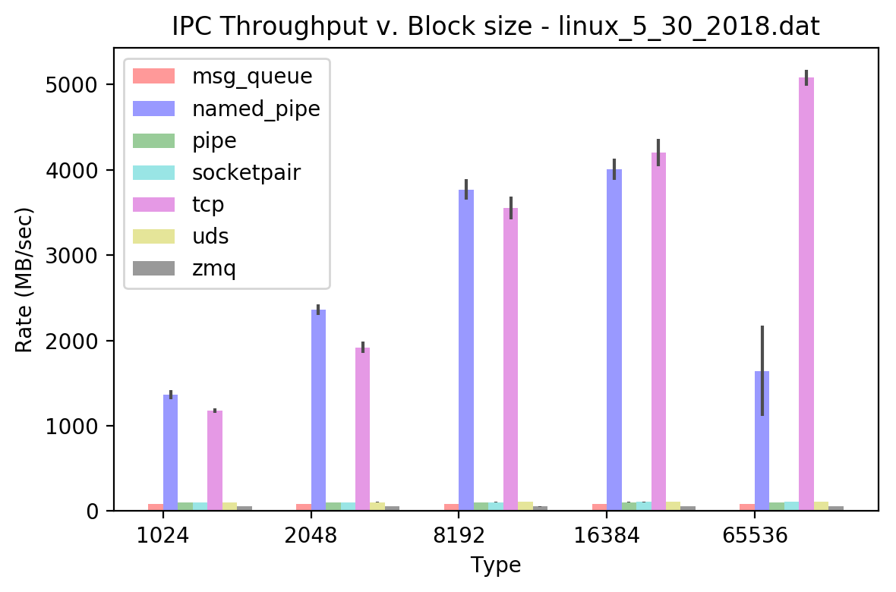

# IPC Report

## Requirements

python 3.6.x

pweave

## Usage

```console
shraken@mint-vbox ~/shraken_code/ipc_benchmark $ python benchmark.py 
usage: benchmark.py [-h] [-t,--trials [TRIAL_RUNS]] [-v,--verbose]
                    [-f,--file SAVE_FILE]

Test the DAC, ADC, and PWM function of the Buddy DAQ device

optional arguments:
  -h, --help            show this help message and exit
  -t,--trials [TRIAL_RUNS]
                        number of trials to be run for each IPC test
  -v,--verbose          enable verbose printing
  -f,--file SAVE_FILE   filename to save pickle results to
```

## Running It

```console
shraken@mint-vbox ~/shraken_code/ipc_benchmark $ python benchmark.py -v -t 100 -f result.dat
```

## Benchmark Result

The figure below compares the throughput (MB/sec) for the different IPC methods when varying the block
size of transmission.  The transfer size for each test is fixed at 100 Megabytes.  


```python
import numpy as np
import matplotlib.pyplot as plt
import pickle
from pprint import pprint
from prettytable import PrettyTable

IPC_BLOCK_SIZE_1024 = 1024
IPC_BLOCK_SIZE_2048 = 2048
IPC_BLOCK_SIZE_4096 = 4096
IPC_BLOCK_SIZE_8192 = 8192
IPC_BLOCK_SIZE_16384 = 16384
IPC_BLOCK_SIZE_32768 = 32768
IPC_BLOCK_SIZE_65536 = 65536

typesToParse = [ 'msg_queue', 'named_pipe', 'pipe', 'socketpair', 'tcp', 'uds', 'zmq' ]
blockSizeList = [ IPC_BLOCK_SIZE_1024, IPC_BLOCK_SIZE_2048, 
                  IPC_BLOCK_SIZE_4096, IPC_BLOCK_SIZE_8192 ]

def getMaxMinValue(results, key):
    return (0, 0)
    #return [ max(results), min(results) ]

def plotResults(filename):
    with open(filename, "rb") as handle:
        result = pickle.load(handle)
    
    print('recorded results')
    print(result)

    colorTypes = [ 'r', 'b', 'g', 'c', 'm', 'y', 'k' ]

    n_groups = 5
    fig, ax = plt.subplots()

    index = np.arange(n_groups)
    bar_width = 0.1

    opacity = 0.4
    error_config = {'ecolor': '0.3'}

    #resultMean = {key: None for key in typesToParse}
    #blankList = {int(key): [] for key in blockSizeList}
    #resultMean = {key: blankList for key in typesToParse}
    #resultStd = {key: blankList for key in typesToParse}

    resultMean = {
        'msg_queue' : {
            IPC_BLOCK_SIZE_1024: [],
            IPC_BLOCK_SIZE_2048: [],
            IPC_BLOCK_SIZE_4096: [],
            IPC_BLOCK_SIZE_8192: [],
            IPC_BLOCK_SIZE_16384: [],
            IPC_BLOCK_SIZE_32768: [],
            IPC_BLOCK_SIZE_65536: [],
        },
        'named_pipe': {
            IPC_BLOCK_SIZE_1024: [],
            IPC_BLOCK_SIZE_2048: [],
            IPC_BLOCK_SIZE_4096: [],
            IPC_BLOCK_SIZE_8192: [],
            IPC_BLOCK_SIZE_16384: [],
            IPC_BLOCK_SIZE_32768: [],
            IPC_BLOCK_SIZE_65536: [],
        },
        'pipe': {
            IPC_BLOCK_SIZE_1024: [],
            IPC_BLOCK_SIZE_2048: [],
            IPC_BLOCK_SIZE_4096: [],
            IPC_BLOCK_SIZE_8192: [],
            IPC_BLOCK_SIZE_16384: [],
            IPC_BLOCK_SIZE_32768: [],
            IPC_BLOCK_SIZE_65536: [],
        },
        'socketpair': {
            IPC_BLOCK_SIZE_1024: [],
            IPC_BLOCK_SIZE_2048: [],
            IPC_BLOCK_SIZE_4096: [],
            IPC_BLOCK_SIZE_8192: [],
            IPC_BLOCK_SIZE_16384: [],
            IPC_BLOCK_SIZE_32768: [],
            IPC_BLOCK_SIZE_65536: [],
        },
        'tcp': {
            IPC_BLOCK_SIZE_1024: [],
            IPC_BLOCK_SIZE_2048: [],
            IPC_BLOCK_SIZE_4096: [],
            IPC_BLOCK_SIZE_8192: [],
            IPC_BLOCK_SIZE_16384: [],
            IPC_BLOCK_SIZE_32768: [],
            IPC_BLOCK_SIZE_65536: [],
        },
        'uds': {
            IPC_BLOCK_SIZE_1024: [],
            IPC_BLOCK_SIZE_2048: [],
            IPC_BLOCK_SIZE_4096: [],
            IPC_BLOCK_SIZE_8192: [],
            IPC_BLOCK_SIZE_16384: [],
            IPC_BLOCK_SIZE_32768: [],
            IPC_BLOCK_SIZE_65536: [],
        },
        'zmq': {
            IPC_BLOCK_SIZE_1024: [],
            IPC_BLOCK_SIZE_2048: [],
            IPC_BLOCK_SIZE_4096: [],
            IPC_BLOCK_SIZE_8192: [],
            IPC_BLOCK_SIZE_16384: [],
            IPC_BLOCK_SIZE_32768: [],
            IPC_BLOCK_SIZE_65536: [],
        }
    }

    resultStd = {
        'msg_queue' : {
            IPC_BLOCK_SIZE_1024: [],
            IPC_BLOCK_SIZE_2048: [],
            IPC_BLOCK_SIZE_4096: [],
            IPC_BLOCK_SIZE_8192: [],
            IPC_BLOCK_SIZE_16384: [],
            IPC_BLOCK_SIZE_32768: [],
            IPC_BLOCK_SIZE_65536: [],
        },
        'named_pipe': {
            IPC_BLOCK_SIZE_1024: [],
            IPC_BLOCK_SIZE_2048: [],
            IPC_BLOCK_SIZE_4096: [],
            IPC_BLOCK_SIZE_8192: [],
            IPC_BLOCK_SIZE_16384: [],
            IPC_BLOCK_SIZE_32768: [],
            IPC_BLOCK_SIZE_65536: [],
        },
        'pipe': {
            IPC_BLOCK_SIZE_1024: [],
            IPC_BLOCK_SIZE_2048: [],
            IPC_BLOCK_SIZE_4096: [],
            IPC_BLOCK_SIZE_8192: [],
            IPC_BLOCK_SIZE_16384: [],
            IPC_BLOCK_SIZE_32768: [],
            IPC_BLOCK_SIZE_65536: [],
        },
        'socketpair': {
            IPC_BLOCK_SIZE_1024: [],
            IPC_BLOCK_SIZE_2048: [],
            IPC_BLOCK_SIZE_4096: [],
            IPC_BLOCK_SIZE_8192: [],
            IPC_BLOCK_SIZE_16384: [],
            IPC_BLOCK_SIZE_32768: [],
            IPC_BLOCK_SIZE_65536: [],
        },
        'tcp': {
            IPC_BLOCK_SIZE_1024: [],
            IPC_BLOCK_SIZE_2048: [],
            IPC_BLOCK_SIZE_4096: [],
            IPC_BLOCK_SIZE_8192: [],
            IPC_BLOCK_SIZE_16384: [],
            IPC_BLOCK_SIZE_32768: [],
            IPC_BLOCK_SIZE_65536: [],
        },
        'uds': {
            IPC_BLOCK_SIZE_1024: [],
            IPC_BLOCK_SIZE_2048: [],
            IPC_BLOCK_SIZE_4096: [],
            IPC_BLOCK_SIZE_8192: [],
            IPC_BLOCK_SIZE_16384: [],
            IPC_BLOCK_SIZE_32768: [],
            IPC_BLOCK_SIZE_65536: [],
        },
        'zmq': {
            IPC_BLOCK_SIZE_1024: [],
            IPC_BLOCK_SIZE_2048: [],
            IPC_BLOCK_SIZE_4096: [],
            IPC_BLOCK_SIZE_8192: [],
            IPC_BLOCK_SIZE_16384: [],
            IPC_BLOCK_SIZE_32768: [],
            IPC_BLOCK_SIZE_65536: [],
        }
    }

    for idx, typeParse in enumerate(typesToParse):
        means_temp = ( np.mean(result[typeParse][IPC_BLOCK_SIZE_1024]),
                       np.mean(result[typeParse][IPC_BLOCK_SIZE_2048]),
                       np.mean(result[typeParse][IPC_BLOCK_SIZE_8192]),
                       np.mean(result[typeParse][IPC_BLOCK_SIZE_16384]),
                       np.mean(result[typeParse][IPC_BLOCK_SIZE_65536]) )

        stds_temp = ( np.std(result[typeParse][IPC_BLOCK_SIZE_1024]),
                      np.std(result[typeParse][IPC_BLOCK_SIZE_2048]),
                      np.std(result[typeParse][IPC_BLOCK_SIZE_8192]),
                      np.std(result[typeParse][IPC_BLOCK_SIZE_16384]),
                      np.std(result[typeParse][IPC_BLOCK_SIZE_65536]) )

        #print('typeParse')
        #print(typeParse)
        #print('means_temp')
        #print(means_temp)

        #print('means_temp')
        #print(means_temp)
        #print('stds_temp')
        #print(stds_temp)

        rects_temp = plt.bar(index + (idx * bar_width), means_temp, bar_width,
                             alpha=opacity,
                             color=colorTypes[idx],
                             yerr=stds_temp,
                             error_kw=error_config,
                             label=typeParse)

        for blockMean, blockStd, blockSize in zip(means_temp, stds_temp, blockSizeList):
            resultMean[typeParse][blockSize] = blockMean
            resultStd[typeParse][blockSize] = blockStd

    plt.xlabel('Type')
    plt.ylabel('Rate (MB/sec)')
    plt.title('IPC Throughput v. Block size - {}'.format(filename))
    plt.xticks(index + bar_width / 2, ('1024', '2048', '8192', '16384',  '65536'))
    plt.legend()

    plt.tight_layout()
    plt.show()

    return (resultMean, resultStd)

(resultMean, resultStd) = plotResults('linux_5_30_2018.dat')

headers = ['', 
           '{:^12}'.format(IPC_BLOCK_SIZE_1024), 
           '{:^12}'.format(IPC_BLOCK_SIZE_2048), 
           '{:^12}'.format(IPC_BLOCK_SIZE_4096), 
           '{:^12}'.format(IPC_BLOCK_SIZE_8192) ]
t = PrettyTable(headers)

for ipcType in typesToParse:
    data = [ '{}'.format(ipcType),
             '{0:.2f}'.format(resultMean[ipcType][IPC_BLOCK_SIZE_1024]),
             '{0:.2f}'.format(resultMean[ipcType][IPC_BLOCK_SIZE_2048]),
             '{0:.2f}'.format(resultMean[ipcType][IPC_BLOCK_SIZE_4096]),
             '{0:.2f}'.format(resultMean[ipcType][IPC_BLOCK_SIZE_8192]) ]

    t.add_row(data)

print(t)
```

```
recorded results
{'uds': {1024: [102.091639, 101.33957, 102.092777, 101.459585,
102.422206, 102.929494, 101.88525, 102.663942, 101.806218, 101.544443,
102.196027, 102.417431, 102.537519, 101.990675, 102.300738,
101.299126, 101.475193, 101.502428, 102.408624, 102.515761, 102.18366,
102.328463, 102.279412, 101.578165, 102.726141], 2048: [106.455379,
106.546258, 106.275603, 106.288884, 105.789755, 105.066111,
105.962239, 106.138869, 105.091312, 106.267573, 106.27362, 103.770728,
104.936546, 105.856255, 107.309491, 106.365484, 105.34633, 106.546366,
104.676483, 105.388172, 106.624848, 106.372132, 106.454386,
105.690751, 104.528048], 4096: [107.288206, 106.336036, 108.700618,
108.72932, 108.116031, 108.882707, 106.747828, 107.84218, 106.522838,
108.213987, 108.468156, 107.791619, 108.141896, 106.801409,
106.799237, 108.401917, 103.364278, 107.981761, 107.949622,
107.507499, 107.47309, 107.434653, 108.380692, 104.088908, 108.41473],
16384: [110.082251, 110.124621, 110.642954, 108.493494, 110.505829,
110.557919, 110.885159, 110.143738, 109.915519, 108.905474,
109.294762, 108.880274, 109.680097, 109.497964, 109.848807,
109.923543, 108.569997, 109.32127, 109.965638, 107.931671, 110.290627,
110.394597, 109.2101, 108.84618, 110.011767], 8192: [108.628169,
109.126398, 107.786734, 109.143103, 109.656554, 109.634632,
109.481555, 107.414864, 107.990895, 108.80008, 109.768902, 108.716744,
109.763348, 109.109403, 108.719132, 107.217336, 108.799906,
109.455228, 109.087372, 109.318074, 109.789231, 109.076301,
108.608722, 109.456757, 108.156554], 65536: [109.154577, 109.741249,
110.517766, 110.817497, 110.448384, 109.905337, 109.213547,
110.571731, 109.490742, 110.026324, 110.256298, 110.507897,
110.219742, 109.137077, 109.759471, 107.450753, 110.497038,
110.876372, 110.663188, 110.053086, 109.03533, 111.257327, 110.522785,
110.265013, 109.889825], 32768: [108.823325, 110.394051, 107.008712,
110.561349, 109.057866, 108.768614, 110.222222, 109.523393,
110.066439, 110.692529, 110.946248, 108.837113, 109.227158,
109.166262, 110.540688, 107.368922, 110.601868, 110.474933,
109.270811, 108.163552, 110.54128, 110.551388, 110.367843, 110.434474,
109.675414]}, 'named_pipe': {1024: [1397.777659, 1379.406108,
1314.894499, 1376.709541, 1369.135436, 1408.667378, 1320.85103,
1399.437817, 1372.181672, 1276.593369, 1356.946623, 1350.085676,
1454.853494, 1342.219091, 1321.278167, 1365.317601, 1257.403784,
1305.805175, 1469.81896, 1441.592565, 1357.728923, 1410.005272,
1356.652401, 1402.438965, 1305.515628], 2048: [2316.357861,
2399.900511, 2313.440801, 2308.820247, 2309.11271, 2362.372768,
2317.447991, 2433.556141, 2356.825114, 2439.892058, 2343.047587,
2334.076229, 2218.894182, 2327.071276, 2410.639079, 2311.793314,
2436.064017, 2262.575286, 2458.177835, 2429.698116, 2456.276465,
2361.948947, 2364.936596, 2294.851974, 2368.573787], 4096:
[3847.423061, 3843.717818, 3792.113454, 3714.791774, 3704.773869,
3833.148481, 3751.086566, 3769.905998, 3545.103077, 3684.133076,
3649.348135, 3623.429479, 3767.79315, 3717.880629, 3756.214687,
3602.09421, 3756.043523, 3861.316692, 3826.796111, 3514.29558,
3751.509663, 3896.818144, 3682.594464, 3567.524648, 3822.39048],
16384: [4091.147349, 4042.616445, 4099.471967, 4151.221303,
4010.045938, 4074.371451, 4172.555019, 4059.009665, 4101.201287,
4030.712366, 3961.073867, 4019.483161, 3995.787614, 4051.800734,
4108.827658, 4032.212621, 3977.328416, 3888.28241, 4000.315261,
3867.681703, 3920.088599, 3603.175891, 4115.535206, 3737.067212,
3962.381929], 8192: [3684.627136, 3730.794103, 3608.903177,
3902.240306, 3710.364158, 3907.242684, 3911.136021, 3694.802649,
3584.143258, 3847.91503, 3873.007205, 3832.327136, 3859.492984,
3678.992701, 3792.743126, 3592.286121, 3770.745801, 3883.829628,
3882.731942, 3834.264835, 3812.413218, 3761.065829, 3787.408918,
3816.019919, 3418.081818], 65536: [1388.397906, 2026.775364,
2266.467665, 1459.828615, 1450.484578, 1518.843816, 1438.529748,
1489.664039, 1486.624564, 1534.430256, 1609.252875, 1547.469832,
1476.995322, 1437.164438, 1458.14553, 1482.45244, 1500.530227,
1455.371713, 4062.523642, 1509.118357, 1410.598025, 1438.775386,
1423.063718, 1801.743754, 1413.545043], 32768: [3362.549189,
3301.64681, 2977.178217, 3316.322336, 3311.88459, 3525.234727,
3012.101004, 3462.081436, 3252.391325, 3288.742839, 3680.135354,
3320.614945, 3370.99752, 3272.840189, 3680.892753, 3771.435919,
3604.456949, 3424.181368, 3415.600079, 3378.566949, 3476.409961,
3583.980642, 3396.787819, 3507.715294, 3364.9126]}, 'msg_queue':
{1024: [83.191915, 84.483258, 85.438398, 84.217365, 85.346077,
84.314991, 84.404959, 84.021873, 85.513247, 84.673882, 85.293449,
85.003596, 84.45318, 84.808812, 84.310157, 84.829319, 85.437093,
85.057786, 84.32608, 84.730647, 84.758384, 84.711179, 85.188148,
84.651265, 85.251443], 2048: [85.529508, 84.835807, 84.323369,
84.838889, 84.903765, 85.180041, 84.706656, 84.950518, 84.102705,
84.766486, 85.820937, 84.81703, 84.94506, 84.856209, 85.407371,
83.669004, 84.639538, 84.899545, 85.240381, 85.400608, 84.384521,
85.081747, 84.53503, 84.772031, 85.290353], 4096: [85.373364,
84.961323, 85.018516, 84.429294, 82.73357, 85.031089, 85.047804,
85.433216, 84.65943, 83.464059, 84.515316, 84.239189, 84.48144,
85.441779, 85.345808, 84.370367, 84.81319, 84.314106, 85.05774,
85.138024, 84.769643, 84.930569, 85.325476, 84.408867, 83.61023],
16384: [84.715002, 84.561001, 85.362024, 84.77202, 84.558987,
85.705018, 83.210142, 84.207377, 85.358884, 85.058713, 85.222356,
84.4427, 85.128547, 84.09345, 84.556298, 84.23515, 84.459418,
84.923333, 85.569343, 84.620493, 84.339195, 84.031582, 85.011616,
84.815376, 84.568843], 8192: [84.647988, 85.322209, 85.536647,
84.33341, 84.881447, 84.187188, 85.159077, 85.188638, 84.955102,
84.889562, 85.317939, 85.082029, 83.388712, 83.9061, 85.408387,
85.370662, 85.197964, 85.132626, 83.952485, 84.749957, 84.735869,
85.414125, 85.369639, 85.328971, 85.404913], 65536: [83.270177,
85.540668, 85.504006, 84.795957, 84.197377, 85.51948, 81.90691,
85.17864, 84.981835, 81.592129, 84.557037, 84.253179, 84.809317,
85.001374, 84.5683, 84.885244, 84.082111, 84.506983, 84.029627,
85.289144, 85.429466, 84.548783, 85.721565, 84.205552, 84.469632],
32768: [84.909123, 85.325004, 84.833392, 85.086203, 84.8337,
84.752454, 85.331107, 84.891409, 83.889815, 83.739367, 84.21163,
85.21712, 85.297744, 85.319524, 85.195452, 81.056589, 84.447011,
85.502884, 85.93951, 84.640025, 84.947234, 85.178208, 84.148143,
84.999846, 85.197298]}, 'tcp': {1024: [1151.47927, 1191.617561,
1188.702902, 1220.380302, 1156.858746, 1186.521606, 1147.283639,
1178.713684, 1138.618834, 1181.119418, 1170.575474, 1219.298728,
1150.775423, 1160.600953, 1143.178442, 1176.913612, 1176.040441,
1213.25139, 1210.612615, 1201.379057, 1227.514002, 1211.009324,
1143.437001, 1161.613596, 1210.931972], 2048: [1956.843709,
1917.429081, 1921.784878, 1984.95796, 1923.557334, 1958.800856,
1982.371796, 1904.647736, 1920.764616, 1995.401952, 1834.171565,
1832.476689, 1816.732157, 1959.707968, 2016.807648, 1948.284928,
1931.590742, 1857.243041, 1703.03503, 1919.86597, 1955.154574,
1950.62831, 1915.14346, 1972.734433, 1855.020522], 4096: [2815.102885,
2743.989961, 2827.387331, 2812.104746, 2754.163089, 2775.041949,
2866.087865, 2808.097736, 2597.348444, 2780.124689, 2227.641523,
2773.815764, 2841.447905, 2852.323606, 2870.496884, 2895.265146,
2848.385253, 2798.468683, 2831.978322, 2714.697673, 2811.871176,
2806.854639, 2834.603602, 2799.774651, 2808.210043], 16384:
[4370.658121, 4278.655999, 4358.329539, 4254.144376, 3801.778755,
4248.357773, 4248.195937, 4292.004066, 4246.197798, 4301.225617,
4222.854984, 4204.927955, 4259.17156, 3606.129859, 4231.488675,
4236.576031, 4262.168663, 4104.895383, 4216.037112, 4231.271458,
4247.044399, 4227.365364, 4146.88093, 4195.807807, 4225.951892], 8192:
[3681.428837, 3339.114046, 3644.451423, 3579.338758, 3643.330818,
3626.035281, 3599.584202, 3279.310949, 3585.933011, 3538.8958,
3653.215854, 3616.289696, 3618.042657, 3636.747206, 3457.623628,
3549.357477, 3632.879452, 3585.770232, 3608.772653, 3643.477858,
3609.5903, 3531.341508, 3203.295183, 3634.425566, 3245.781735], 65536:
[5118.042784, 5020.404974, 5092.116184, 5191.951209, 5123.215514,
5156.042884, 5011.99025, 5137.571158, 5089.710128, 5117.946068,
5038.042338, 4959.712771, 5051.533607, 5102.724417, 5133.606306,
4850.506735, 5091.364047, 5207.395974, 5045.725531, 4871.47077,
5115.48794, 5036.048272, 5023.677607, 5212.034442, 5223.508526],
32768: [4422.451626, 4803.790195, 4895.560557, 4760.28265,
4682.530301, 4799.570146, 4593.612952, 4796.146053, 4734.615846,
4767.105472, 3818.664045, 4441.52602, 4759.780688, 4814.635728,
4295.378436, 4620.392058, 4101.600568, 4725.834969, 4118.986688,
4798.270358, 4753.705795, 4619.648982, 4661.953647, 4297.949236,
4898.026936]}, 'pipe': {1024: [101.133957, 101.384567, 100.562417,
100.262765, 100.3963, 101.00645, 101.372413, 101.101231, 101.025724,
98.884702, 99.27773, 100.132144, 99.549592, 101.062416, 101.226086,
101.152849, 99.558719, 99.961178, 100.207644, 101.080294, 101.219147,
101.207875, 101.224038, 99.806019, 100.677865], 2048: [103.224607,
104.657431, 104.14844, 104.449461, 104.821533, 103.442413, 103.306669,
104.132943, 104.269005, 104.122357, 104.360577, 104.748582,
100.043826, 101.830322, 104.128876, 102.657716, 104.256166,
102.523451, 103.068036, 103.170713, 101.236762, 104.613125,
104.976541, 104.204661, 104.102031], 4096: [105.561811, 104.993022,
104.312963, 105.764826, 105.493649, 105.889738, 105.982118,
104.677107, 104.43518, 105.816456, 105.766832, 105.872358, 105.789861,
105.328684, 104.478064, 105.265767, 106.479869, 105.872465,
106.062779, 105.757811, 106.172774, 102.927152, 105.29945, 104.962719,
105.988938], 16384: [104.450986, 101.603784, 106.080732, 105.893281,
100.676924, 105.812895, 106.956895, 106.130277, 105.751729,
106.232976, 104.206162, 103.014809, 104.767452, 104.380464,
105.956317, 105.85281, 104.727675, 105.323809, 103.359764, 105.924863,
106.409071, 104.302518, 105.864773, 106.315707, 104.703076], 8192:
[105.552448, 103.96275, 105.827106, 104.981022, 105.009835, 105.90752,
104.008624, 106.053007, 105.448954, 103.275126, 106.61734, 103.848227,
105.668548, 106.189783, 105.873641, 105.192523, 104.901829,
104.558567, 105.912507, 105.800406, 104.075023, 106.40814, 105.366424,
104.599855, 106.051429], 65536: [100.871899, 98.437529, 100.743408,
101.175829, 100.103873, 100.134973, 101.935304, 103.960749, 98.226929,
100.994085, 101.654303, 99.792212, 101.41764, 100.667916, 99.82477,
99.688042, 101.919149, 100.354614, 101.633099, 100.789897, 101.412199,
102.147945, 101.569621, 101.33743, 99.790826], 32768: [104.127561,
105.47384, 105.497159, 104.048845, 103.999426, 104.568106, 102.612459,
105.960853, 105.467192, 105.33192, 105.63401, 105.821418, 102.828372,
104.395477, 105.273453, 105.372123, 105.452503, 106.056389,
103.430494, 102.73772, 104.203309, 105.311067, 103.823437, 103.478989,
104.929025]}, 'zmq': {1024: [54.370868, 53.946631, 55.83651,
55.616866, 55.432517, 55.285957, 55.488068, 55.356591, 55.173185,
55.406477, 55.524589, 55.630222, 55.630613, 55.343435, 55.317052,
55.813385, 54.565537, 55.649648, 55.824105, 55.102334, 53.739869,
54.617301, 55.528481, 54.735366, 55.077227], 2048: [53.92326,
56.063388, 55.472674, 55.35621, 55.357173, 56.440233, 55.871165,
55.027496, 55.581913, 56.106334, 54.957964, 55.915696, 56.500578,
55.715377, 56.329985, 56.294463, 55.810904, 56.416664, 55.697884,
55.435393, 56.285357, 55.871285, 56.333098, 55.101526, 56.376328],
4096: [56.369413, 55.88271, 56.093102, 55.813585, 56.329417,
56.550982, 56.020185, 56.718602, 56.427569, 55.90589, 56.581304,
55.178319, 55.386398, 56.338716, 56.772344, 56.608022, 56.743056,
55.487991, 56.783817, 56.858918, 57.112217, 57.136247, 55.78653,
55.610791, 55.65485], 16384: [56.572305, 56.892035, 56.914119,
57.020519, 56.900988, 55.69362, 56.834202, 57.121416, 56.678118,
56.324641, 57.051378, 57.134162, 56.592101, 56.888641, 56.407751,
57.178158, 56.93073, 56.255403, 56.73775, 55.728037, 56.008272,
56.680362, 56.867678, 56.900168, 55.916103], 8192: [57.012446,
56.99721, 57.270142, 56.477733, 55.55625, 54.929036, 56.261994,
55.487517, 56.857005, 56.237976, 43.054581, 55.778964, 56.047318,
56.417421, 55.81185, 55.422449, 55.895286, 56.647971, 50.393613,
55.744036, 55.293495, 56.693501, 56.761901, 56.803861, 56.806062],
65536: [55.710996, 57.023052, 55.69101, 56.847285, 55.73714,
55.785053, 56.151325, 55.651816, 55.589462, 55.543928, 55.694767,
56.699439, 55.639462, 55.786788, 55.781529, 55.634777, 55.472785,
56.083579, 55.564007, 55.764554, 55.889081, 55.782105, 56.769925,
55.65086, 55.867138], 32768: [56.611668, 56.88556, 55.973297,
57.210194, 56.287922, 57.496266, 55.962251, 55.999846, 56.6026,
56.220718, 56.421212, 56.000093, 56.152706, 57.342282, 55.842592,
56.085203, 56.088986, 56.339794, 56.976675, 55.901599, 55.914117,
55.86003, 56.144775, 56.160664, 55.864697]}, 'socketpair': {1024:
[97.641072, 99.059833, 99.302795, 98.72364, 98.906013, 98.179016,
97.297833, 99.038021, 98.942332, 98.608873, 99.241284, 98.194099,
95.802509, 97.355182, 98.894053, 98.949422, 99.009899, 98.506589,
98.840164, 97.727448, 97.906023, 99.117833, 98.889045, 99.112993,
95.489927], 2048: [103.124857, 102.223871, 102.17866, 103.162954,
103.134136, 103.505191, 102.883383, 101.603141, 102.426279,
103.216093, 103.521859, 102.624362, 102.846027, 103.338788,
102.253606, 102.272168, 103.030775, 102.721359, 103.161153,
103.089114, 103.034214, 102.315313, 102.521521, 103.12631,
103.011674], 4096: [105.409402, 105.794088, 105.105563, 103.79368,
104.727658, 105.101566, 105.777018, 105.151466, 104.221297,
104.603231, 104.156113, 105.705177, 105.184428, 104.979784,
105.109526, 105.045043, 103.964044, 104.823544, 105.015192, 105.44096,
105.362969, 105.296502, 104.882411, 104.156674, 105.158115], 16384:
[105.990585, 106.527076, 107.503019, 106.987509, 105.946008,
106.334706, 106.531811, 106.822375, 107.048796, 107.137187,
107.450509, 107.151635, 106.717224, 106.117719, 106.999423,
107.306928, 107.009074, 107.721784, 107.104327, 105.978303,
105.730166, 104.688593, 107.033905, 107.168177, 107.047406], 8192:
[107.418692, 104.22148, 106.806157, 106.445851, 105.528136,
105.649192, 106.355131, 106.588136, 106.145471, 107.124201,
105.803216, 105.578647, 105.402533, 106.469434, 106.340754, 106.42149,
105.4359, 106.835794, 105.973996, 106.469327, 106.543174, 106.889638,
106.529608, 106.338242, 105.049688], 65536: [107.784142, 107.478299,
106.598702, 106.040052, 107.148068, 107.958437, 107.542797,
107.271845, 106.885781, 105.953356, 106.486717, 107.519919,
107.600765, 107.167056, 107.590915, 106.801993, 106.31585, 106.966653,
107.402876, 106.345901, 107.887515, 106.989731, 106.294147,
106.552528, 107.672724], 32768: [107.379127, 106.630965, 106.585829,
107.275548, 107.250545, 107.260253, 108.159245, 106.350734,
106.307975, 107.600606, 107.657279, 107.345972, 107.366563,
106.919249, 106.002426, 106.327304, 107.287131, 107.420883,
108.124478, 107.513584, 107.318044, 106.385318, 107.129946,
107.865232, 107.49418]}}
+------------+--------------+--------------+--------------+--------------+
|            |     1024     |     2048     |     4096     |     8192
|
+------------+--------------+--------------+--------------+--------------+
| msg_queue  |    84.74     |    84.88     |    84.91     |    84.70
|
| named_pipe |   1364.53    |   2357.45    |   3767.10    |   4002.94
|
|    pipe    |    100.58    |    103.62    |    105.24    |    104.99
|
| socketpair |    98.35     |    102.81    |    106.17    |    106.72
|
|    tcp     |   1180.74    |   1917.41    |   3549.76    |   4200.72
|
|    uds     |    102.08    |    105.84    |    108.91    |    109.68
|
|    zmq     |    55.20     |    55.77     |    55.47     |    56.65
|
+------------+--------------+--------------+--------------+--------------+
```

\

