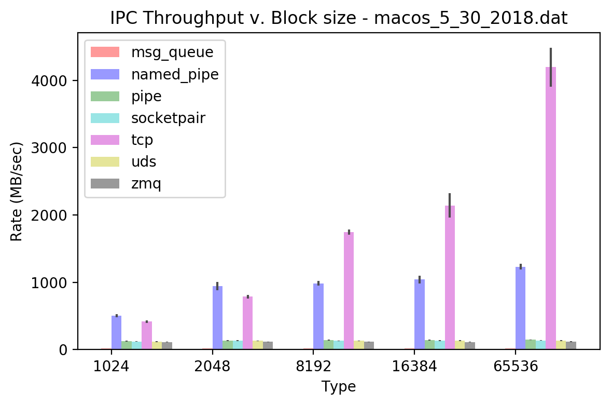

# IPC Report

## Requirements

python 3.6.x

pweave

## Usage

```console
shraken@mint-vbox ~/shraken_code/ipc_benchmark $ python benchmark.py 
usage: benchmark.py [-h] [-t,--trials [TRIAL_RUNS]] [-v,--verbose]
                    [-f,--file SAVE_FILE]

Test the DAC, ADC, and PWM function of the Buddy DAQ device

optional arguments:
  -h, --help            show this help message and exit
  -t,--trials [TRIAL_RUNS]
                        number of trials to be run for each IPC test
  -v,--verbose          enable verbose printing
  -f,--file SAVE_FILE   filename to save pickle results to
```

## Running It

```console
shraken@mint-vbox ~/shraken_code/ipc_benchmark $ python benchmark.py -v -t 100 -f result.dat
```

## Benchmark Result

The figure below compares the throughput (MB/sec) for the different IPC methods when varying the block
size of transmission.  The transfer size for each test is fixed at 100 Megabytes.  


```python
import numpy as np
import matplotlib.pyplot as plt
import pickle
from pprint import pprint
from prettytable import PrettyTable

IPC_BLOCK_SIZE_1024 = 1024
IPC_BLOCK_SIZE_2048 = 2048
IPC_BLOCK_SIZE_4096 = 4096
IPC_BLOCK_SIZE_8192 = 8192
IPC_BLOCK_SIZE_16384 = 16384
IPC_BLOCK_SIZE_32768 = 32768
IPC_BLOCK_SIZE_65536 = 65536

typesToParse = [ 'msg_queue', 'named_pipe', 'pipe', 'socketpair', 'tcp', 'uds', 'zmq' ]
blockSizeList = [ IPC_BLOCK_SIZE_1024, IPC_BLOCK_SIZE_2048, 
                  IPC_BLOCK_SIZE_4096, IPC_BLOCK_SIZE_8192 ]

def getMaxMinValue(results, key):
    return (0, 0)
    #return [ max(results), min(results) ]

def plotResults(filename):
    with open(filename, "rb") as handle:
        result = pickle.load(handle)
    
    print('recorded results')
    print(result)

    colorTypes = [ 'r', 'b', 'g', 'c', 'm', 'y', 'k' ]

    n_groups = 5
    fig, ax = plt.subplots()

    index = np.arange(n_groups)
    bar_width = 0.1

    opacity = 0.4
    error_config = {'ecolor': '0.3'}

    #resultMean = {key: None for key in typesToParse}
    #blankList = {int(key): [] for key in blockSizeList}
    #resultMean = {key: blankList for key in typesToParse}
    #resultStd = {key: blankList for key in typesToParse}

    resultMean = {
        'msg_queue' : {
            IPC_BLOCK_SIZE_1024: [],
            IPC_BLOCK_SIZE_2048: [],
            IPC_BLOCK_SIZE_4096: [],
            IPC_BLOCK_SIZE_8192: [],
            IPC_BLOCK_SIZE_16384: [],
            IPC_BLOCK_SIZE_32768: [],
            IPC_BLOCK_SIZE_65536: [],
        },
        'named_pipe': {
            IPC_BLOCK_SIZE_1024: [],
            IPC_BLOCK_SIZE_2048: [],
            IPC_BLOCK_SIZE_4096: [],
            IPC_BLOCK_SIZE_8192: [],
            IPC_BLOCK_SIZE_16384: [],
            IPC_BLOCK_SIZE_32768: [],
            IPC_BLOCK_SIZE_65536: [],
        },
        'pipe': {
            IPC_BLOCK_SIZE_1024: [],
            IPC_BLOCK_SIZE_2048: [],
            IPC_BLOCK_SIZE_4096: [],
            IPC_BLOCK_SIZE_8192: [],
            IPC_BLOCK_SIZE_16384: [],
            IPC_BLOCK_SIZE_32768: [],
            IPC_BLOCK_SIZE_65536: [],
        },
        'socketpair': {
            IPC_BLOCK_SIZE_1024: [],
            IPC_BLOCK_SIZE_2048: [],
            IPC_BLOCK_SIZE_4096: [],
            IPC_BLOCK_SIZE_8192: [],
            IPC_BLOCK_SIZE_16384: [],
            IPC_BLOCK_SIZE_32768: [],
            IPC_BLOCK_SIZE_65536: [],
        },
        'tcp': {
            IPC_BLOCK_SIZE_1024: [],
            IPC_BLOCK_SIZE_2048: [],
            IPC_BLOCK_SIZE_4096: [],
            IPC_BLOCK_SIZE_8192: [],
            IPC_BLOCK_SIZE_16384: [],
            IPC_BLOCK_SIZE_32768: [],
            IPC_BLOCK_SIZE_65536: [],
        },
        'uds': {
            IPC_BLOCK_SIZE_1024: [],
            IPC_BLOCK_SIZE_2048: [],
            IPC_BLOCK_SIZE_4096: [],
            IPC_BLOCK_SIZE_8192: [],
            IPC_BLOCK_SIZE_16384: [],
            IPC_BLOCK_SIZE_32768: [],
            IPC_BLOCK_SIZE_65536: [],
        },
        'zmq': {
            IPC_BLOCK_SIZE_1024: [],
            IPC_BLOCK_SIZE_2048: [],
            IPC_BLOCK_SIZE_4096: [],
            IPC_BLOCK_SIZE_8192: [],
            IPC_BLOCK_SIZE_16384: [],
            IPC_BLOCK_SIZE_32768: [],
            IPC_BLOCK_SIZE_65536: [],
        }
    }

    resultStd = {
        'msg_queue' : {
            IPC_BLOCK_SIZE_1024: [],
            IPC_BLOCK_SIZE_2048: [],
            IPC_BLOCK_SIZE_4096: [],
            IPC_BLOCK_SIZE_8192: [],
            IPC_BLOCK_SIZE_16384: [],
            IPC_BLOCK_SIZE_32768: [],
            IPC_BLOCK_SIZE_65536: [],
        },
        'named_pipe': {
            IPC_BLOCK_SIZE_1024: [],
            IPC_BLOCK_SIZE_2048: [],
            IPC_BLOCK_SIZE_4096: [],
            IPC_BLOCK_SIZE_8192: [],
            IPC_BLOCK_SIZE_16384: [],
            IPC_BLOCK_SIZE_32768: [],
            IPC_BLOCK_SIZE_65536: [],
        },
        'pipe': {
            IPC_BLOCK_SIZE_1024: [],
            IPC_BLOCK_SIZE_2048: [],
            IPC_BLOCK_SIZE_4096: [],
            IPC_BLOCK_SIZE_8192: [],
            IPC_BLOCK_SIZE_16384: [],
            IPC_BLOCK_SIZE_32768: [],
            IPC_BLOCK_SIZE_65536: [],
        },
        'socketpair': {
            IPC_BLOCK_SIZE_1024: [],
            IPC_BLOCK_SIZE_2048: [],
            IPC_BLOCK_SIZE_4096: [],
            IPC_BLOCK_SIZE_8192: [],
            IPC_BLOCK_SIZE_16384: [],
            IPC_BLOCK_SIZE_32768: [],
            IPC_BLOCK_SIZE_65536: [],
        },
        'tcp': {
            IPC_BLOCK_SIZE_1024: [],
            IPC_BLOCK_SIZE_2048: [],
            IPC_BLOCK_SIZE_4096: [],
            IPC_BLOCK_SIZE_8192: [],
            IPC_BLOCK_SIZE_16384: [],
            IPC_BLOCK_SIZE_32768: [],
            IPC_BLOCK_SIZE_65536: [],
        },
        'uds': {
            IPC_BLOCK_SIZE_1024: [],
            IPC_BLOCK_SIZE_2048: [],
            IPC_BLOCK_SIZE_4096: [],
            IPC_BLOCK_SIZE_8192: [],
            IPC_BLOCK_SIZE_16384: [],
            IPC_BLOCK_SIZE_32768: [],
            IPC_BLOCK_SIZE_65536: [],
        },
        'zmq': {
            IPC_BLOCK_SIZE_1024: [],
            IPC_BLOCK_SIZE_2048: [],
            IPC_BLOCK_SIZE_4096: [],
            IPC_BLOCK_SIZE_8192: [],
            IPC_BLOCK_SIZE_16384: [],
            IPC_BLOCK_SIZE_32768: [],
            IPC_BLOCK_SIZE_65536: [],
        }
    }

    for idx, typeParse in enumerate(typesToParse):
        means_temp = ( np.mean(result[typeParse][IPC_BLOCK_SIZE_1024]),
                       np.mean(result[typeParse][IPC_BLOCK_SIZE_2048]),
                       np.mean(result[typeParse][IPC_BLOCK_SIZE_8192]),
                       np.mean(result[typeParse][IPC_BLOCK_SIZE_16384]),
                       np.mean(result[typeParse][IPC_BLOCK_SIZE_65536]) )

        stds_temp = ( np.std(result[typeParse][IPC_BLOCK_SIZE_1024]),
                      np.std(result[typeParse][IPC_BLOCK_SIZE_2048]),
                      np.std(result[typeParse][IPC_BLOCK_SIZE_8192]),
                      np.std(result[typeParse][IPC_BLOCK_SIZE_16384]),
                      np.std(result[typeParse][IPC_BLOCK_SIZE_65536]) )

        #print('typeParse')
        #print(typeParse)
        #print('means_temp')
        #print(means_temp)

        #print('means_temp')
        #print(means_temp)
        #print('stds_temp')
        #print(stds_temp)

        rects_temp = plt.bar(index + (idx * bar_width), means_temp, bar_width,
                             alpha=opacity,
                             color=colorTypes[idx],
                             yerr=stds_temp,
                             error_kw=error_config,
                             label=typeParse)

        for blockMean, blockStd, blockSize in zip(means_temp, stds_temp, blockSizeList):
            resultMean[typeParse][blockSize] = blockMean
            resultStd[typeParse][blockSize] = blockStd

    plt.xlabel('Type')
    plt.ylabel('Rate (MB/sec)')
    plt.title('IPC Throughput v. Block size - {}'.format(filename))
    plt.xticks(index + bar_width / 2, ('1024', '2048', '8192', '16384',  '65536'))
    plt.legend()

    plt.tight_layout()
    plt.show()

    return (resultMean, resultStd)

(resultMean, resultStd) = plotResults('macos_5_30_2018.dat')

headers = ['', 
           '{:^12}'.format(IPC_BLOCK_SIZE_1024), 
           '{:^12}'.format(IPC_BLOCK_SIZE_2048), 
           '{:^12}'.format(IPC_BLOCK_SIZE_4096), 
           '{:^12}'.format(IPC_BLOCK_SIZE_8192) ]
t = PrettyTable(headers)

for ipcType in typesToParse:
    data = [ '{}'.format(ipcType),
             '{0:.2f}'.format(resultMean[ipcType][IPC_BLOCK_SIZE_1024]),
             '{0:.2f}'.format(resultMean[ipcType][IPC_BLOCK_SIZE_2048]),
             '{0:.2f}'.format(resultMean[ipcType][IPC_BLOCK_SIZE_4096]),
             '{0:.2f}'.format(resultMean[ipcType][IPC_BLOCK_SIZE_8192]) ]

    t.add_row(data)

print(t)
```

```
recorded results
{'uds': {1024: [116.041916, 119.959271, 109.976603, 118.830607,
118.233349, 102.521499, 103.254753, 112.006164, 122.10212, 120.647279,
118.288301, 118.856935, 120.833738, 120.294689, 121.889242,
120.808937, 119.732676, 121.81588, 120.45929, 118.917451, 119.53915,
120.688969, 123.094212, 120.880882, 122.775034], 2048: [121.92327,
124.320268, 126.809563, 130.538816, 133.327122, 122.266528,
123.862037, 134.701308, 134.411137, 134.879329, 135.899904,
134.643679, 135.025299, 134.402361, 133.878232, 136.271114,
135.707834, 135.045949, 134.992244, 135.46269, 134.488571, 136.115432,
135.2125, 135.361202, 134.742178], 4096: [132.430206, 133.123392,
140.291335, 138.017403, 140.755144, 128.139281, 132.464915,
144.522659, 142.830008, 143.45334, 144.616576, 143.782627, 143.558699,
144.05076, 144.094293, 142.618326, 144.070968, 144.263031, 143.708916,
142.626609, 144.771604, 144.415618, 144.58994, 143.900363,
145.012222], 16384: [116.289465, 132.69631, 119.831266, 132.142699,
122.75814, 109.507407, 125.3743, 136.172578, 135.541099, 136.257177,
136.121961, 136.456631, 136.678236, 136.64098, 136.437432, 136.626199,
135.259731, 136.595348, 135.866284, 136.876781, 135.6192, 136.74918,
136.147006, 135.803762, 136.420438], 8192: [125.018772, 131.427674,
129.848023, 130.233916, 130.613525, 119.419418, 124.746349,
134.843843, 135.340919, 134.625723, 133.202634, 134.705328,
133.897341, 135.696352, 135.108112, 134.856485, 135.273735,
134.674295, 135.047036, 135.263707, 135.033714, 135.003116,
134.719179, 134.835259, 134.946256], 65536: [134.071042, 129.572111,
133.748213, 135.549181, 120.557884, 121.164785, 127.689809,
138.276196, 139.081943, 136.948525, 139.174457, 138.647296, 137.63957,
139.170483, 139.148245, 138.593221, 138.584853, 138.707683, 138.63298,
138.653542, 139.081759, 138.9245, 139.259248, 139.232186, 138.23646],
32768: [121.036173, 125.80269, 133.14959, 135.2711, 107.17349,
123.626044, 127.96608, 138.376599, 138.162767, 138.437175, 138.838276,
138.425369, 138.491411, 138.519926, 138.346709, 138.878307,
138.359057, 137.860224, 133.925793, 137.129663, 137.429213,
139.207302, 138.55138, 139.416436, 138.195619]}, 'named_pipe': {1024:
[462.666367, 487.546842, 474.336533, 498.770168, 506.261939,
493.882022, 449.100652, 476.452127, 522.88506, 530.298885, 546.716374,
496.773663, 483.820978, 518.097055, 479.939761, 535.485814, 542.65032,
513.597057, 548.66569, 513.278489, 525.650534, 504.804985, 501.924461,
480.071381, 491.328245], 2048: [824.818807, 959.673017, 827.422598,
935.08336, 916.467778, 828.134263, 839.330602, 975.24843, 927.607832,
962.634759, 958.851279, 1009.42666, 975.326197, 993.116382,
987.789777, 919.139501, 1041.929664, 927.558363, 977.113245,
951.770229, 1044.293127, 981.749689, 996.382739, 961.189129,
935.208366], 4096: [1661.389989, 1572.350464, 1667.52168, 1616.950035,
1642.493743, 1609.01386, 1558.090578, 1660.27403, 1797.001128,
1725.593849, 1693.349871, 1888.759558, 1696.535124, 1765.596757,
1679.728355, 1678.916156, 1669.47175, 1759.421016, 1698.789598,
1677.316372, 1744.136143, 1720.841627, 1638.618082, 1772.665899,
1651.037618], 16384: [1027.539293, 1052.361124, 806.123963,
971.388741, 1037.507153, 941.311755, 1019.378255, 1063.190757,
1071.257871, 1053.455808, 1071.865964, 1068.682963, 1063.107289,
1074.386228, 1089.107297, 1048.954273, 1058.744751, 1046.563911,
1069.264614, 1067.00545, 1060.784408, 1072.656182, 1064.91969,
1071.639362, 1055.169056], 8192: [869.351576, 991.95553, 988.711901,
996.10161, 924.329365, 900.59157, 954.679472, 1004.070891, 988.784095,
995.975493, 997.31731, 992.540813, 1004.605613, 979.80233,
1005.170215, 1013.873271, 982.086872, 1007.699516, 1027.253668,
1012.434659, 994.19288, 981.488442, 1010.018757, 982.374398,
1012.763495], 65536: [1246.503196, 1172.003964, 1205.618476,
1246.084534, 1059.238099, 1168.25277, 1192.838164, 1225.589648,
1230.738185, 1256.693642, 1245.19489, 1251.468206, 1248.262022,
1247.583511, 1255.716426, 1241.412386, 1254.66018, 1257.361253,
1252.78394, 1248.459307, 1262.928831, 1251.374862, 1253.98548,
1249.715992, 1254.78059], 32768: [1211.34824, 935.576658, 1200.368127,
1216.049878, 999.125899, 1104.915056, 1167.821706, 1226.764969,
1221.829851, 1218.105574, 1241.111688, 1236.646064, 1191.541169,
1221.537777, 1217.646327, 1234.186607, 1231.172181, 1230.399513,
1243.718778, 1221.590513, 1193.267619, 1218.507209, 1224.559727,
1230.500935, 1227.032546]}, 'msg_queue': {1024: [20.974446, 20.813457,
20.601084, 21.128213, 21.20048, 20.242461, 20.291181, 20.611016,
21.386789, 21.378595, 21.410695, 21.415418, 21.326045, 21.395267,
21.34636, 21.403605, 21.427374, 21.352982, 21.413874, 21.414156,
21.405075, 21.449261, 21.428778, 21.395835, 21.421064], 2048:
[20.978145, 21.146549, 20.130837, 21.061604, 21.259581, 20.384106,
19.9057, 21.07627, 21.361115, 21.387296, 21.375353, 21.380196,
21.411018, 21.426566, 21.42789, 21.423704, 21.417432, 21.419589,
21.398226, 21.419782, 21.372462, 21.402159, 21.361489, 21.384089,
21.390315], 4096: [20.779483, 20.712166, 20.591124, 21.062111,
20.909782, 20.21781, 20.46789, 21.341913, 21.402152, 21.313752,
21.324405, 21.337395, 21.368841, 21.337633, 21.32619, 21.339876,
21.453276, 21.403576, 21.378994, 21.404483, 21.368589, 21.291707,
21.35346, 21.316143, 21.340432], 16384: [20.493519, 21.190929,
21.046359, 21.092489, 20.593844, 20.245997, 20.567117, 21.303334,
21.414971, 21.284675, 21.370141, 21.414743, 21.410544, 21.417523,
21.388165, 21.382396, 21.433098, 21.373155, 21.406248, 21.404783,
21.43113, 21.446686, 21.405572, 21.361778, 21.388029], 8192:
[20.352498, 21.071877, 20.439783, 21.091794, 21.124933, 20.357253,
20.622515, 21.298725, 21.380779, 21.451539, 21.38539, 21.398663,
21.418724, 21.320326, 21.35356, 21.368664, 21.389479, 21.430909,
21.427163, 21.362213, 21.380407, 21.457118, 21.409836, 21.360799,
21.427476], 65536: [21.179185, 20.102377, 21.1281, 21.165034, 20.136,
20.388714, 20.609365, 21.364144, 21.35484, 21.432411, 21.34885,
21.42323, 21.35375, 21.384918, 21.413558, 21.364317, 21.453246,
21.459386, 21.308126, 21.3889, 21.383354, 21.347151, 21.40632,
21.454464, 21.371676], 32768: [21.022593, 20.546937, 21.109284,
21.208257, 20.464109, 20.303062, 20.606439, 21.330779, 21.393686,
21.427856, 21.392099, 21.423726, 21.35716, 21.391956, 21.462546,
21.390425, 21.41948, 21.444649, 21.39858, 21.39598, 21.429086,
21.345164, 21.358358, 21.382269, 21.348913]}, 'tcp': {1024:
[419.03658, 432.848611, 371.764879, 422.07218, 434.765104, 394.560517,
350.303247, 403.30318, 418.503304, 438.846036, 411.925518, 407.271017,
430.049873, 435.178269, 423.909776, 425.810683, 421.310358,
430.443468, 416.513149, 404.665741, 421.608587, 416.487071,
428.130736, 437.167807, 419.436525], 2048: [683.3064, 809.038426,
762.553489, 807.125758, 801.680219, 747.054423, 779.723595,
802.980368, 793.167342, 791.901728, 782.873239, 780.661131,
811.836349, 792.667571, 787.992731, 798.173046, 783.725373,
798.354215, 797.60822, 784.539753, 776.784385, 825.264387, 807.268731,
819.312228, 786.067335], 4096: [1464.373975, 1485.905646, 1519.692417,
1482.973109, 1458.44279, 1399.375839, 1432.829485, 1502.395978,
1488.855649, 1462.840663, 1511.9298, 1521.42421, 1538.63324,
1494.634201, 1526.032608, 1476.521388, 1455.08687, 1526.71097,
1494.958316, 1450.496786, 1519.177299, 1474.406204, 1509.489647,
1527.195532, 1456.223554], 16384: [1623.231305, 2185.827945,
1809.351091, 1967.650556, 2081.837597, 1643.7384, 2079.946425,
2156.724353, 2202.680882, 2182.152136, 2214.094909, 2213.911333,
2224.071702, 2161.876773, 2222.827833, 2286.201105, 2257.289726,
2237.220833, 2264.93779, 2256.765752, 2188.558198, 2248.004544,
2253.091343, 2259.740854, 2260.797205], 8192: [1762.07346,
1759.746009, 1758.110829, 1592.857534, 1701.221033, 1712.239129,
1693.401297, 1752.959231, 1761.307323, 1769.472673, 1784.706041,
1773.944759, 1779.594737, 1769.665924, 1774.781744, 1727.030617,
1764.187062, 1735.584132, 1767.812781, 1740.165834, 1757.274831,
1758.003229, 1765.203853, 1782.199497, 1763.866991], 65536:
[4302.289564, 3695.277967, 4387.286362, 4292.509398, 3616.703628,
3329.198509, 3616.317289, 4334.553662, 4352.346163, 4111.64359,
4377.338739, 4468.598857, 4438.98851, 4264.354514, 4274.488486,
4326.649705, 4337.905962, 4378.875542, 4128.800399, 4278.752566,
4273.101119, 4309.222968, 4358.239367, 4356.767073, 4222.328303],
32768: [3120.484523, 2580.186275, 2704.840495, 3255.960636,
2348.769085, 2935.532204, 3012.038792, 3302.843229, 3307.106762,
3231.689511, 3229.8451, 3291.969369, 3282.206428, 3259.773184,
3285.773178, 3307.62605, 3244.842874, 3266.102296, 2960.067276,
3224.840033, 3307.666446, 3274.12325, 3299.009698, 3274.920724,
3304.368771]}, 'pipe': {1024: [123.426431, 120.143502, 119.469334,
127.882704, 129.655604, 112.11024, 114.745085, 121.895786, 129.369597,
131.921344, 131.61599, 130.468637, 131.234337, 131.235091, 131.680869,
132.094619, 132.314719, 132.475476, 131.499072, 132.115239,
132.544801, 130.897717, 132.087809, 130.793232, 132.603356], 2048:
[112.033898, 130.609557, 129.843247, 134.506787, 136.5306, 124.119603,
126.9582, 140.645908, 140.649383, 138.563886, 139.681237, 139.859693,
139.340988, 139.351957, 139.856639, 138.970153, 139.996051,
139.438903, 138.399277, 140.029554, 138.165193, 139.511151,
141.134708, 138.157219, 139.2513], 4096: [136.08697, 121.636079,
141.160811, 139.451139, 139.61456, 127.141206, 132.620907, 143.430657,
144.931539, 144.40299, 143.945302, 144.465524, 144.860343, 143.284324,
144.103263, 144.722148, 144.362151, 144.320621, 144.671843,
142.483517, 144.732556, 144.755409, 143.795703, 143.679117,
144.113549], 16384: [139.034636, 143.290529, 132.878613, 142.739783,
132.768451, 117.096315, 135.976313, 148.9276, 147.132241, 147.879363,
147.299773, 148.010285, 148.559953, 148.444967, 148.251434,
147.748568, 148.655928, 148.710792, 148.711842, 148.658306,
148.932747, 147.812121, 148.871746, 148.466334, 148.309782], 8192:
[125.200599, 142.586855, 140.766202, 140.818219, 128.830103,
126.705835, 134.802537, 146.229038, 146.141769, 145.938271,
146.537762, 147.115492, 147.002228, 146.647883, 146.587242,
146.531272, 147.283798, 146.24993, 146.296325, 146.762225, 147.142587,
147.094386, 147.728029, 146.424685, 147.539782], 65536: [147.552976,
135.010837, 142.698333, 147.046297, 132.420096, 129.758882, 139.01549,
148.68981, 150.654215, 150.062786, 150.371538, 152.597574, 151.121885,
150.573627, 151.021317, 150.642244, 149.444192, 150.728921,
150.352481, 150.500401, 150.267249, 151.111959, 150.299486,
150.587573, 151.139222], 32768: [145.760247, 139.09579, 143.72407,
145.842697, 132.923938, 132.781804, 137.791158, 149.722077,
149.644231, 150.146823, 149.541113, 148.367746, 148.573726,
149.103187, 148.975921, 149.440858, 149.569098, 149.773755,
149.357256, 149.39426, 149.785588, 147.997344, 149.751312, 149.784038,
150.273002]}, 'zmq': {1024: [109.948106, 111.2927, 104.591511,
112.52885, 109.597061, 105.769588, 100.136058, 107.548056, 115.652691,
114.796403, 115.762229, 115.577059, 115.148165, 115.419513,
115.818084, 115.593281, 115.931856, 115.583429, 115.857699,
114.910579, 115.199284, 115.472731, 115.689842, 115.356749,
115.758561], 2048: [107.231278, 103.189649, 116.993465, 111.714155,
114.420288, 102.996855, 104.841578, 117.558429, 118.46752, 120.240321,
116.739046, 118.271771, 118.075198, 120.525257, 117.809372,
118.187533, 118.236955, 116.968894, 118.267647, 117.849555,
118.230083, 117.473442, 119.573372, 119.13542, 118.90023], 4096:
[105.519789, 108.415505, 116.813839, 115.939924, 116.325471,
105.049763, 109.111996, 120.009746, 117.961703, 119.1796, 119.399562,
118.512731, 119.296997, 122.418879, 120.456244, 118.589615, 119.6328,
117.842442, 119.140414, 119.347923, 120.001391, 123.338961, 119.71983,
119.952448, 119.380878], 16384: [106.28693, 112.99771, 108.338514,
113.855538, 107.497228, 98.901199, 107.756145, 116.089866, 116.193027,
116.019845, 115.949816, 115.995766, 120.828517, 116.428715,
116.044722, 115.855462, 116.072999, 116.093733, 116.5164, 115.838493,
115.878349, 116.075309, 116.903014, 116.386915, 115.0957], 8192:
[109.874667, 111.160538, 118.64204, 115.959249, 114.950439,
106.983253, 114.626844, 119.434283, 120.234365, 119.28808, 120.315706,
119.23407, 119.272342, 119.615454, 120.073199, 119.109717, 120.471974,
119.421817, 120.333798, 120.372817, 119.845401, 117.144105,
119.913427, 119.377157, 119.549997], 65536: [119.281287, 117.172769,
117.058487, 119.422524, 106.370139, 106.585464, 113.599911,
121.359902, 121.394506, 121.839483, 121.548697, 126.527423,
121.797285, 121.566413, 117.497242, 121.52346, 121.142998, 121.40277,
121.136093, 120.543664, 121.396589, 121.795845, 121.751574,
121.754107, 121.553263], 32768: [121.341935, 87.680054, 114.723476,
117.046548, 102.744457, 100.051297, 111.501275, 119.103408,
119.929289, 119.831387, 118.344789, 118.315851, 119.576275,
118.833736, 118.956976, 119.389419, 120.269017, 118.897777,
118.645344, 119.019371, 119.470252, 119.118016, 119.806851,
119.456348, 119.805375]}, 'socketpair': {1024: [115.346789, 118.12839,
112.580498, 118.839248, 121.119052, 111.132896, 111.236183,
114.831017, 122.560557, 122.632678, 123.569179, 124.353212,
124.892951, 123.108632, 123.565136, 123.721906, 124.029307,
122.339099, 123.426165, 123.804527, 123.368698, 124.175154,
124.849038, 124.311268, 123.469935], 2048: [119.213159, 134.22725,
132.508782, 132.674514, 133.982422, 122.045973, 125.450302,
135.663871, 137.899262, 135.91826, 138.453362, 137.468904, 137.786831,
136.435989, 137.343819, 136.989097, 136.370274, 137.796436,
136.907226, 136.561766, 136.959378, 138.362894, 137.352814,
137.958187, 136.96775], 4096: [134.442697, 125.547228, 141.707763,
137.317994, 141.740999, 126.867955, 133.533676, 144.554848,
145.008762, 143.725541, 145.068647, 145.134004, 145.301145,
145.113852, 145.669249, 145.963788, 145.090119, 143.55871, 144.462453,
145.627188, 145.355756, 145.890081, 145.457979, 145.218617,
145.426525], 16384: [119.263301, 125.026785, 123.545891, 131.84272,
124.795512, 114.41127, 126.484978, 136.898872, 136.777318, 136.881841,
136.783101, 136.370686, 136.718392, 137.377169, 136.569646,
136.747592, 136.268734, 136.00909, 136.668275, 136.17741, 136.347628,
136.886546, 136.470963, 136.771092, 136.294431], 8192: [119.864079,
132.188529, 130.742062, 131.343231, 118.502382, 120.452463,
125.579029, 135.401003, 135.608548, 134.886507, 134.004459,
136.198552, 135.557981, 134.193578, 135.228047, 135.282181,
135.435071, 135.181946, 135.565562, 135.374753, 134.641957,
135.379181, 135.20251, 135.834393, 135.461809], 65536: [136.099329,
125.373156, 133.868759, 136.352825, 124.54623, 122.660408, 128.879086,
138.563532, 138.312079, 138.052951, 138.627942, 139.371883,
139.496975, 137.166681, 139.181211, 139.065497, 139.136512,
139.631712, 139.258675, 138.839018, 139.227759, 139.539493,
139.827694, 139.421993, 139.20581], 32768: [122.115255, 127.546457,
133.605197, 136.033274, 119.668065, 123.233172, 128.475505,
138.438884, 137.793541, 138.396711, 139.50026, 138.127001, 138.556473,
138.785201, 137.996015, 137.938021, 139.126005, 139.182999,
139.693732, 139.191133, 138.853671, 138.238567, 138.515929,
138.281914, 139.162892]}}
+------------+--------------+--------------+--------------+--------------+
|            |     1024     |     2048     |     4096     |     8192
|
+------------+--------------+--------------+--------------+--------------+
| msg_queue  |    21.19     |    21.19     |    21.20     |    21.21
|
| named_pipe |    503.40    |    946.29    |    984.73    |   1041.05
|
|    pipe    |    128.25    |    136.22    |    143.24    |    144.53
|
| socketpair |    121.02    |    134.77    |    132.52    |    132.98
|
|    tcp     |    416.64    |    788.47    |   1748.30    |   2139.30
|
|    uds     |    118.10    |    132.57    |    132.74    |    132.43
|
|    zmq     |    113.00    |    115.68    |    117.81    |    114.00
|
+------------+--------------+--------------+--------------+--------------+
```

\

